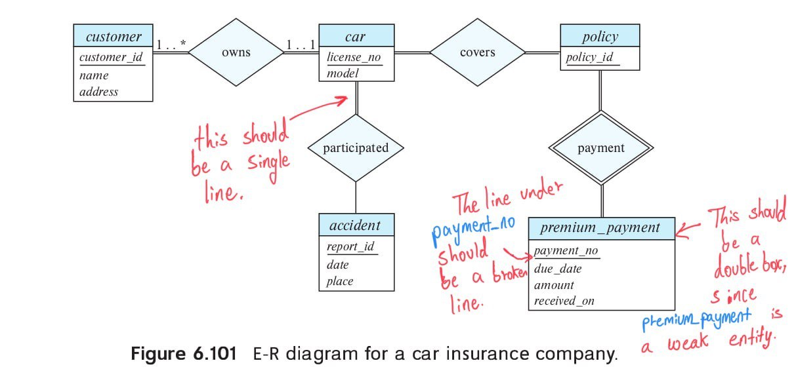

> Construct an E-R diagram for a car insurance company
> whose customers own one or more cars each. Each car
> has associated with it zero to any number of 
> recorded accidents. Each insurance policy covers
> one or more cars and has one or more premium 
> payments associated with it. Each payment is for a 
> particular period of time, and has an associated 
> due date, and the date when the payment was 
> received. 

--------------------------------

One possible ER diagram is shown in Figure 6.101. 
Payments are modeled as weak entities since they 
are related to a specific policy. Note that 
the participation of accident in the relationship
_participated_ is not total, since it is possible
that there is an accident report where the 
participating car is unknown.

Note that the double-line connecting the entity set
_car_ to the relationship _participated_ should be
a single-line, since we could have cars that have
not participated in any accident until now. That is,
the participation of the entity _car_ in the relationship
_participated_ is **not total**, thus it is **partial**.

Also note that, given a _premium_payment_ we can not identify
for which _car_ that _premium_payment_ was made for. So there
is some bug that needs to get fixed in the E-R diagram if we
want to determine the _car_ given a _premium_payment_ info.