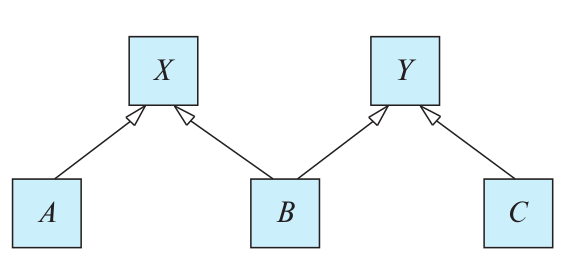

> Consider the following lattice structure of generalization and specialization (attributes
> are not shown).

> For entity sets $A$, $B$, and $C$, explain how attributes are inherited from the higher
> level entity sets $X$ and $Y$. Discuss how to handle a case where an attribute of $X$
> has the same name as some attribute of $Y$. 

--------------------------------

$A$ inherits all the attributes of $X$, plus it may define its own attributes. Similarly, $C$
inherits all the attributes of $Y$ plus its own attributes. $B$ inherits the attributes of both
$X$ and $Y$. If there is some attribute _name_ which belongs to both $X$ and $Y$, it may be 
referred to in $B$ by the qualified name $X$._name_ or $Y$._name_.