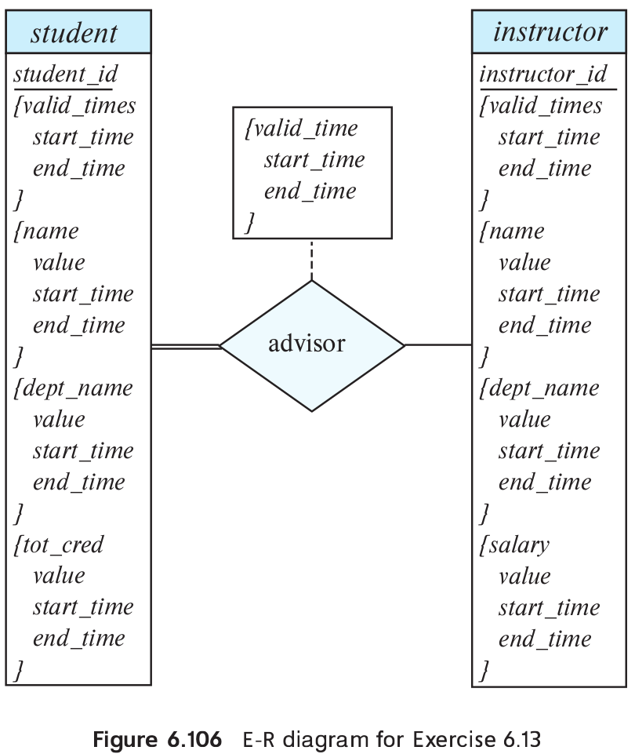
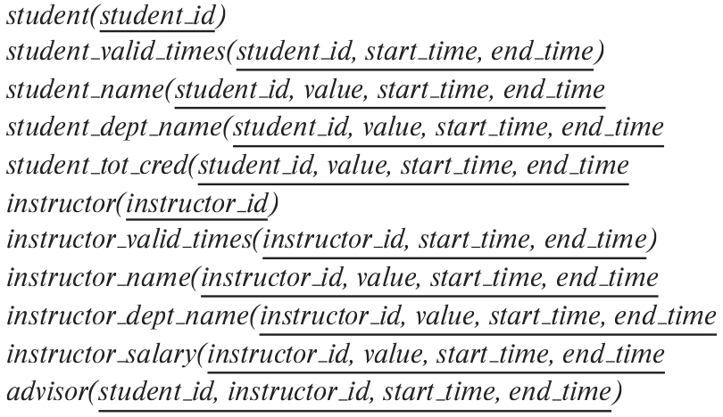

> An E-R diagram usually models the state of an enterprise at a point in time. 
> Suppose we wish to track _temporal changes_, that is, changes to data over time. 
> For example, Zhang may have been a student between September 2015 and May 2019, 
> while Shankar may have had instructor Einstein as advisor from May 2018 to December
> 2018, and again from June 2019 to January 2020. Similary, attribute values of an 
> entity or relationship, such as _title_ and _credits_ of _course_, _salary_, or even
> _name_ of _instructor_, and _tot_cred_ of _student_, can change over time.
> 
> One way to model temporal changes is as follows: We define a new data type called 
> **valid_time**, which is a time interval, or a set of time intervals. We then 
> associate a _valid_time_ attribute with each entity and relationship, recording the 
> time periods during which the entity or relationship is valid. The end time of an interval
> can be infinity; for example, if Shankar became a student in September 2018, and is still
> a student, we can represent the end time of the _valid_time_ interval as infinity for 
> the Shankar entity. Similarly, we model attributes that can change over time as a set of values, 
> each with its own _valid_time_.
> 
> a. Draw an E-R diagram with the _student_ and _instructor_ entities, and the _advisor_ 
> relationship, with the above extensions to track temporal changes.
> 
> b. Convert the E-R diagram discussed above into a set of relations. 
> 
> It should be clear that the set of relations generated is rather complex, leading 
> to difficulties in tasks such as writing queries in SQL. An alternative approach, 
> which is used more widely, is to ignore temporal changes when designing the E-R 
> model (in particular, temporal changes to attribute values), and to modify the relations
> generated from the E-R Model to track temporal changes. 

--------------------------------

a. The E-R diagram is shown in Figure 6.106.

The primary key attributes _student_id_ and _instructor_id_ are assumed to be 
immutable, that is, they are not allowed to change with time. All other attributes 
are assumed to potentially change with time. 

Note that the diagram uses multivalued composite attributes such as _valid_times_
or _name_, with subattributes such as _start_time_ or _value_. The _value_
attribute is a subattribute of several attributes such as _name_, _tot_cred_
and _salary_, and refers to the name, total credits or salary during a particular
interval of time. 

b. The generated relations are as shown below. Each multivalued attribute has turned
into a relation, with the relation name consisting of the original relation name
concatenated with the name of the multivalued attribute. The relation corresponding to 
the entity has only the primary-key attribute, and this is needed to ensure uniqueness.

The primary keys shown are derived directly from the E-R diagram. If we add the 
additional constraint that time intervals cannot overlap (or even the weaker condition
that one start time cannot have two end times), we can remove the _end_time_ from 
all the above primary keys. 
