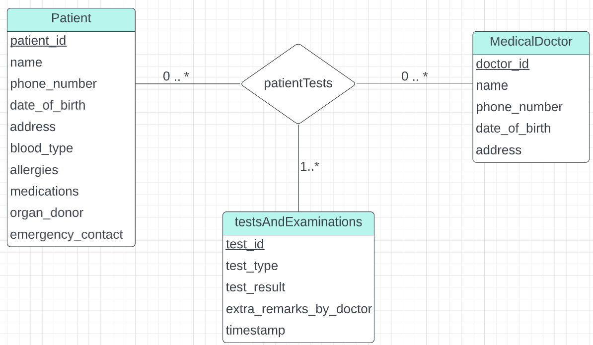

> Construct an E-R diagram for a hospital with a set of patients and a set of medical
> doctors. Associate with each patient a log of the various tests and examinations
> conducted. 

--------------------------------

`patientTests` is a ternary relationship set. 

Another method is, to make the `testsAndExaminations` entity a weak entity having identifying
entity set `Patient`. And then adding a relationship set between the weak entity `testsAndExaminations`
and `MedicalDoctor`, representing which medical doctor performed which test and examination.
In fact doing that has the added benefit of constraining each entity in `testsAndExaminations` to a 
single `Patient`.

But using a ternary relationship as depicted in the above diagram, also has its benefits. For example, 
if a group of patients are tested and examined by the same type of test and have the same result, we
might associate each of the patients in the group to the same entity in `testsAndExaminations`.