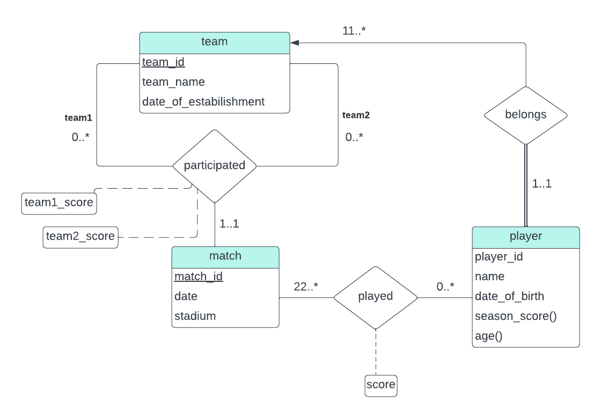

> Extend the E-R diagram of Exercise 6.3 to track the same information
> for all teams in a league. 

--------------------------------

The above design assumes that the game is soccer. That explains the 
mapping cardinalties given in the picture.