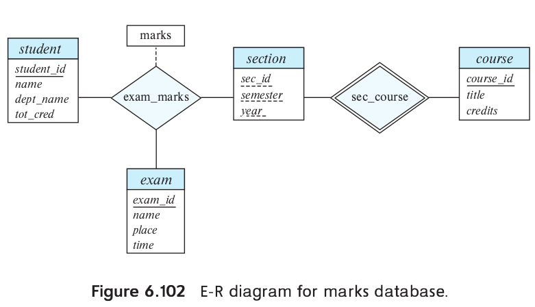
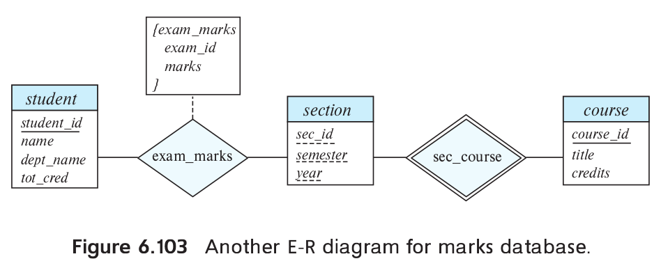

> Consider a database that includes the entity sets
> _student_, _course_, and _section_ from the 
> university schema and that additionally records
> the marks that students receive in different 
> exams of different sections. 
> 
> a. Construct an E-R diagram that models exams
> as entities and uses a ternary relationship
> as part of the design.
> 
> b. Construct an alternative E-R diagram that uses
> only a binary relationship between _student_ and 
> _section_. Make sure that only one relationship 
> exists between a particular _student_ and _section_
> pair, yet you can represent the marks that a student
> gets in different exams. 

--------------------------------

a. The E-R diagram is shown in Figure 6.102. Note that
an alternative is to model examinations as weak 
entities related to a section, rather than as strong
entities. The _exam_marks_ relationship would then be a 
binary relationship between _student_ and _exam_,
without directly involving _section_.

b. The E-R diagram is shown in Figure 6.103. Note 
that here we have not modeled the name, place, and 
time of the exam as part of the relationship 
attributes. Doing so would result in duplication of 
the information, once per student, and we would 
not be able to record this information without
an associated student. If we wish to represent this
information, we need to retain a separate entity
corresponding to each exam.

Note that: _exam_marks_, the _descriptive attribute_ of the 
relationship _exam_marks_, is a composite multivalued attribute.