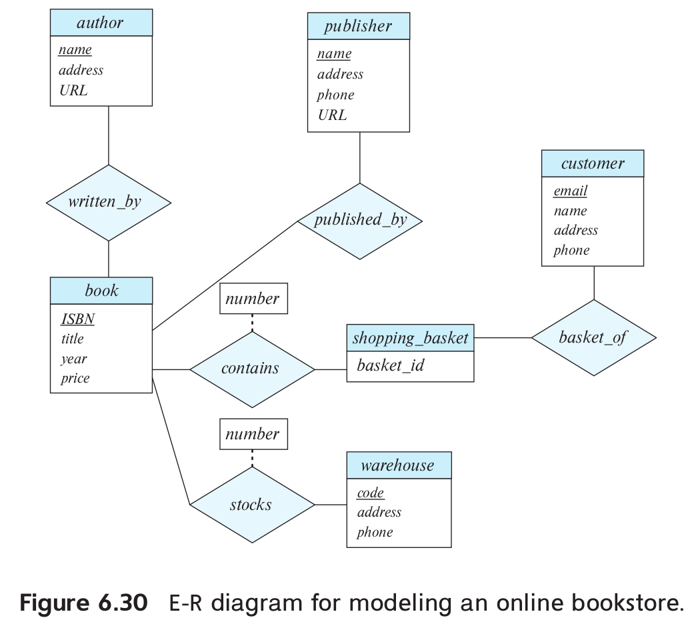
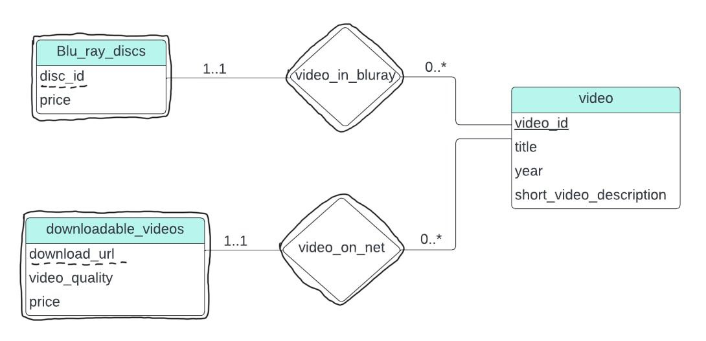
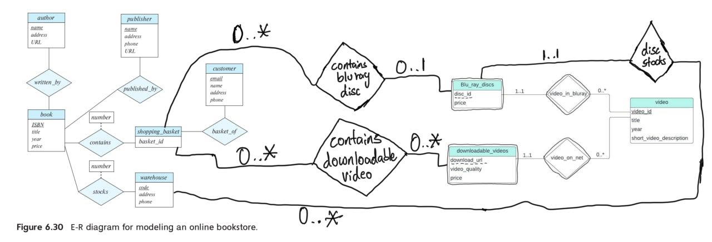

> Consider the E-R diagram in Figure 6.30, which models an online bookstore. 
> 
> a. Suppose the bookstore adds Blu-ray discs and downloadable video to its 
> collection. The same item may be present in one or both formats, with
> differing prices. Draw the part of the E-R diagram that models this addition, 
> show just the parts related to video.
> 
> b. Now extend the full E-R diagram to model the case where a shopping basket
> may contain any combination of books, Blu-ray discs, or downloadable video.  

--------------------------------

a. 

Note that `Blu_ray_discs` and `downloadable_videos` are weak entities while 
 `video_in_bluray` and `video_on_net` are the identifying relationships sets.
`video` is the identifying entity set and owns both of the weak entities.

b. 

