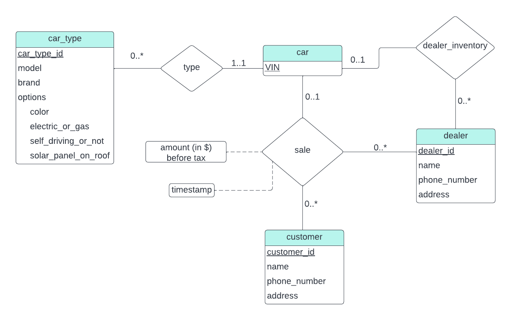

> Design a database for an automobile company to provide to its dealers
> to assist them in maintaining customer records and dealer inventory and 
> to assist sales staff in ordering cars. 
> 
> Each vehicle is identified by a vehicle identification number (VIN). Each
> individual vehicle is a particular model of a particular brand offered by the
> company (e.g., the XF is a model of the car brand Jaguar of Tata Motors). Each
> model can be offered with a variety of options, but an individual car may have 
> only some (or none) of the available options. The database needs to store
> information about models, brands, and options, as well as information about 
> individual dealers, customers, and cars. 
> 
> Your design should include an E-R diagram, a set of relational schemas, and 
> a list of constraints, including primary-key and foreign-key constraints.

--------------------------------

The above figure displays the E-R diagram of the database for the 
automobile company. The attribute `options` of the entity set `car_type`
is a composite attribute. The ternary relationship set `sales` represents a 
single trasaction or a sale of a car. A `dealer` may have never sold a car
or have sold numerous cars. A `customer` may have never bought a car or 
have bought numerous cars. But a particular car has either been sold or
in stock. This constraints are represented as mapping cardinalities in the 
diagram. 

When we change the diagram to a relational 
schema we get the following: 

<i>
car_type(<u>car_type_id</u>, model, brand, color, electric_or_gas, self_driving_or_not,solar_panel_on_roof)  
car(<u>VIN</u>, car_type_id, dealer_id)  
customer(<u>customer_id</u>, name, phone_number, address)  
dealer(<u>dealer_id</u>, name, phone_number, address)  
sale(<u>VIN</u>, <u>customer_id</u>, <u>dealer_id</u>, amount, timestamp)  
</i>

 

The attributes `car_type_id` and `dealer_id` in the relation `car` are foreign-keys
referencing `car_type` and `dealer` relations respectively. The `sale` relation has 
`VIN`, `customer_id` and `dealer_id` as foreign-keys referencing the relations
`car_type`, `customer` and `dealer` respectively. 