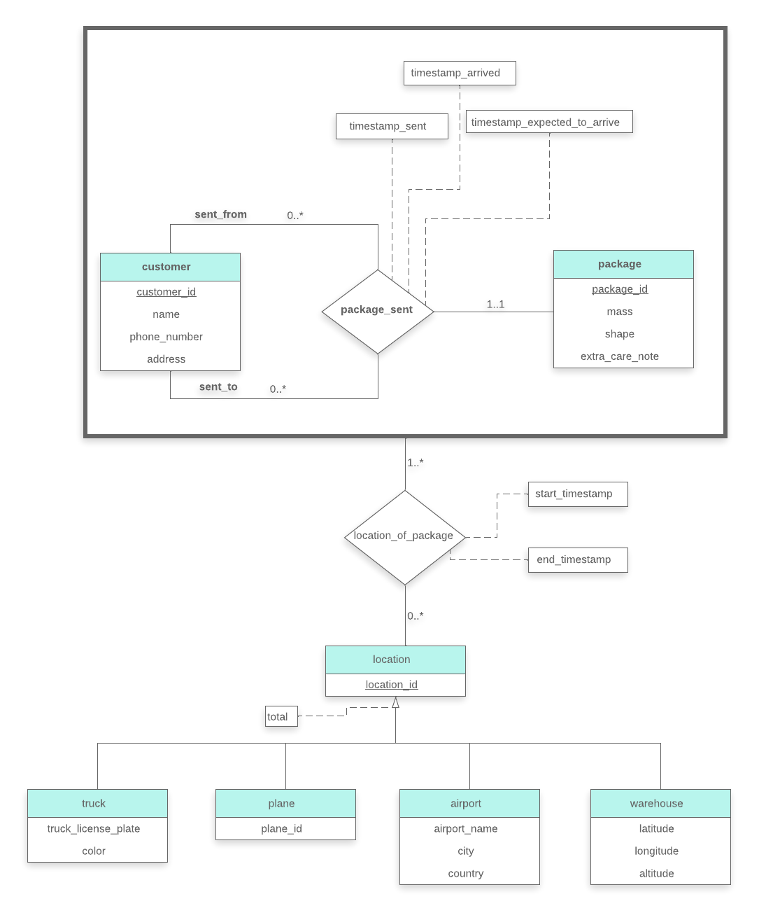

> Design a database for a worldwide package delivery company (e.g., DHL or FedEx). The 
> database must be able to keep track of customers who ship items and customers who 
> receive tiems; some customers may do both. Each package must be identifiable and 
> trackable, so the database must be able to store the location of the package and 
> its history of locations. Locations include trucks, planes, airports, and warehouses.
> 
> Your design should include an E-R diagram, a set of relational schemas, and 
> a list of constraints, including primary-key and foreign-key constraints.

--------------------------------

The above picture shows E-R diagram for the package delivery company. Note that 
it uses **specialization/generalization** and **aggregation**. Also the **specialization**
is both **total** and **disjoint**.

Relation Schemas: 

<i>
customer(<u>customer_id</u>, name, phone_number, address)  
package(<u>package_id</u>,mass,shape,extra_care_note,sent_from,sent_to,timestamp_sent, timestamp_arrived,timestamp_expected_to_arrive)  
location(<u>location_id</u>)  
truck(<u>location_id</u>, truck_license_plate, color)  
plane(<u>location_id</u>,plane_id)  
airport(<u>location_id</u>,airport_name,city,country) 
warehouse(<u>location_id</u>,latitude,longitude,altitude) 
location_of_package(<u>package_id</u>, <u>location_id</u>, start_timestamp, end_timestamp)  
</i>

 

Note that we have merged the relationship set `package_sent` and the entity set `package` when
changing the E-R diagram to a relational schema above into the relation `package`.

The primary key of `truck`, `plane`, `airport`, and `warehouse` is `location_id`. 
Note also that their primary key is also a foreign key to the `location` relation. 

Another foreign-key can be found in the `package` relation. Both `sent_from` and `sent_to` attributes
are foreign-keys from the `package` relation referencing the `customer` relation.

The `location_id` of the relation `location_of_packages` references the `location` relation.
The `package_id` of the relation `location_of_packages` references the `package` relation.