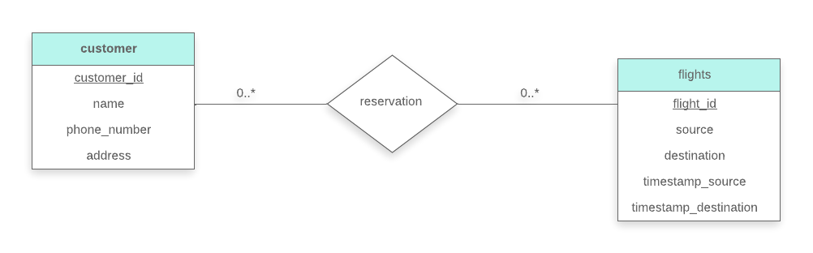

> Design a database for an airline. The database must keep track of customers
> and their reservations, flights and their status, seat assignments on 
> individual flights, and the schedule and routing of future flights. 
> 
> Your design should include an E-R diagram, a set of relational schemas, and 
> a list of constraints, including primary-key and foreign-key cosntraints. 

--------------------------------

Relation schemas:

<i>
customer(<u>customer_id</u>, name, phone_number, address)  
flights(<u>flight_id</u>,src,dest,timestamp_src,timestamp_dest) 
reservation(<u>customer_id</u>,<u>flight_id</u>) 
</i>

 

Note: This is a very simplistic design!