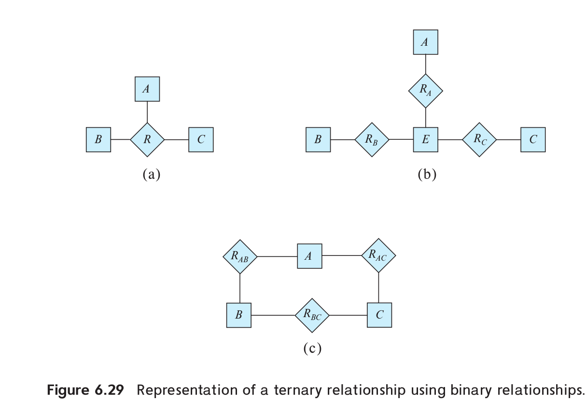

> In Section 6.9.4, we represented a ternary relationship (repeated in Figure
> 6.29a) using binary relationships, as shown in Figure 6.29b. Consider the 
> alternative shown in Figure 6.29c. Discuss the relative mertis of these
> two alternative representations of a ternary relationship by binary relationships.

--------------------------------

For Figure 6.29b to represent a ternary relationship, all relationship sets 
$R_A$, $R_B$, and $R_C$ need to be many-to-one relationships, with a total 
participation from entity set $E$.

Let $(a,b,c)$ in $R$ (the ternary relationship in the above figure). Then we insert

* $(a,b)$ in $R_{AB}$
* $(b,c)$ in $R_{BC}$
* $(c,a)$ in $R_{AC}$

TODO: This answer needs more explanation. 