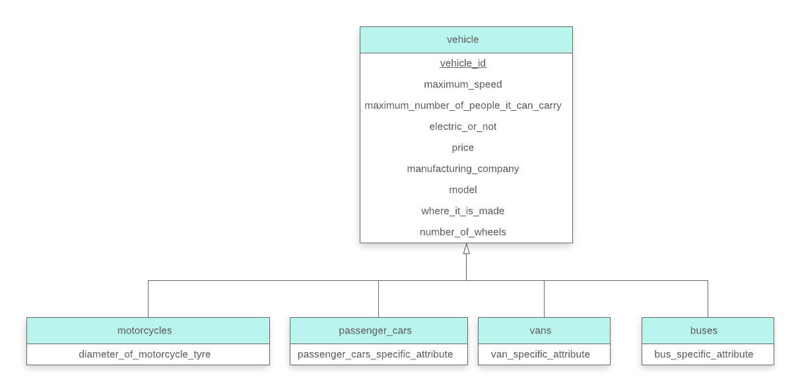

> Design a generalization-specialization hierarchy for a motor vehicle sales 
> company. The company sells motorcycles, passenger cars, vans, and buses. Justify
> your placement of attributes at each level of the hierarchy. Explain why they should 
> not be placed at a higher or lower level.

--------------------------------

TODO: This answer requires more explanation.