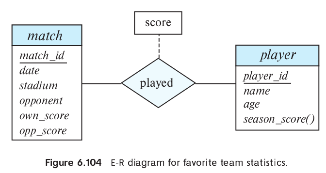

> Design an E-R diagram for keeping track of the 
> scoring statistics of your favorite sports team.
> You should store **the matches played**, **the scores 
> in each match**, **the players in each match**, and 
> **individual player scoring statistics for each match**.
> Summary statistics should be modeled as derived
> attributes with an explanation as to how they
> are computed.

--------------------------------

The diagram is shown in Figure 6.104. The derived 
attribute _season_score_ is computed by summing
the score values associated with the _player_
entity set via the _played_ relationship set.

