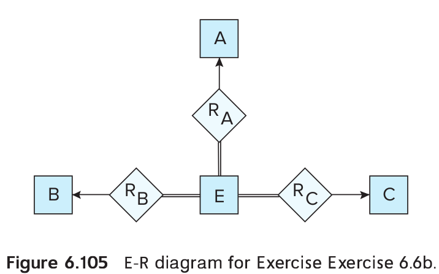

> Consider the representation of the ternary relationship 
> of Figure 6.29a using the binary relationships illustrated
> in Figure 6.29b (attributes not shown).
> 
> a. Show a simple instance of $E$,$A$,$B$,$C$,$R_A$,$R_B$, and $R_C$
> that cannot correspond to any instance of $A$, $B$, $C$, and $R$.  
> 
> b. Modify the E-R diagram of Figure 6.29b to introduce constraints
> that will guarantee that any instance of $E$,$A$,$B$,$C$,$R_A$,$R_B$, 
> and $R_C$ that satisfies the constraints will correspond to an instance
> of $A$, $B$, $C$, and $R$.  
> 
> c. Modify the preceding translation to handle total participation 
> constraints on the ternary relationship.  

--------------------------------

a. Let $E = \{e_1, e_2\}$, $A = \{a_1, a_2\}$, $B = \{b_1\}$, 
$C = \{c_1\}$, $R_A = \{ (e_1, a_1), (e_2, a_2)\}$, 
$R_B = \{ (e_1, b_1)\}$, $R_C = \{ (e_1, c_1)\}$. We see that because
of the tuple $(e_2,a_2)$, no instance of $A$,$B$,$C$, and $R$ exists that 
correspond to $E$,$R_A$,$R_B$, and $R_C$

b. See Figure 6.105. The idea is to introduce total participation constraints
between $E$ and the relationships $R_A$, $R_B$, $R_C$ so that every tuple in 
$E$ has a relationship with $A$,$B$, and $C$.

c. Suppose $A$ totally participates in the relationship $R$, then introduce a 
total participation constraint between $A$ and $R_A$, and similarly for $B$ and
$C$.