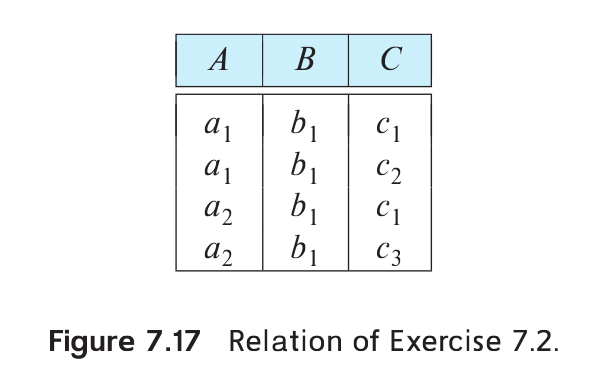

> List all nontrivial functional dependencies satisfied by the relation 
> of Figure 7.17.

--------------------------------

The nontrivial functional dependencies are $A \rightarrow B$ and $C \rightarrow B$, 
and a dependency they logically imply: $AC \rightarrow B$. $C$ does not functionally 
determine $A$ because the first and third tuples have the same $C$ value but different 
$A$ values. The same tuples also show $B$ does not functionally determine $A$. Likewise, 
$A$ does not functionally determine $C$ because the first two tuples have the same $A$ 
value and different $C$ values. The same tuples also show $B$ does not functionally 
determine $C$. There are 19 trivial functional dependencies of the form $\alpha \rightarrow \beta$, 
where $\beta \subseteq \alpha$.