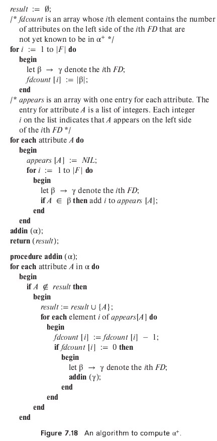

> Consider the algorithm in Figure 7.18 to compute $\alpha^+$. Show that 
> this algorithm is more efficient than the one presented in Figure 7.8 
> (Section 7.4.2) and that it computes $\alpha^+$ correctly. 

--------------------------------

The algorithm is correct because: 

* If $A$ is added to _result_ then there is a proof that $\alpha \rightarrow A$. To
see this, observe that $\alpha \rightarrow \alpha$ trivially, so $\alpha$ is correctly
part of _result_. If $A \not\in \alpha$ is added to _result_, there must be some 
FD $\beta \rightarrow \gamma$ such that $A \in \gamma$ and $\beta$ is already a subset 
of _result_. (Otherwise _fdcount_ would be nonzero and the **if** condition would be false.)
A full proof can be given by induction on the depth of recursion for an execution of 
**addin**, but such a proof can be expected only from students with a good mathematical 
background. 

* If $A \in \alpha^+$, then $A$ is eventually added to _result_. We prove this by induction
on the length of the proof of $\alpha \rightarrow A$ using Armstrong's axioms. First 
observe that if procedure **addin** is called with some argument $\beta$, all the attributes 
in $\beta$ will be added to _result_. Also if a particular FD's _fdcount_ becomes 0, 
all the attributes in its tail will definitely be added to _result_. The base case 
of the proof, $A \in \alpha \Rightarrow A \in \alpha^+$, is obviously true because the 
first call to **addin** has the argument $\alpha$. The inductive hypothesis is that 
if $\alpha \rightarrow A$ can be proved in n steps or less, then $A \in$ _result_.
If there is a proof in $n + 1$ steps that $\alpha \rightarrow A$, then the last step was an 
application of either reflexivity, augmentation, or transitivity on a fact 
$\alpha \rightarrow \beta$ provided in $n$ or fewer steps. If reflexivity or 
augmentation was used in the $(n+1)^{st}$ step, $A$ must have been in _result_
by the end of the $n^{th}$ step itself. Otherwise, by the inductive hypothesis, 
$\beta \subseteq$ _result_. Therefore, the dependency used in proving 
$\beta \rightarrow \gamma$, $A \in \gamma$, will have _fdcount_ set to 0 by the end of 
the $n^{th}$ step. Hence $A$ will be added to _result_. 

To see that this algorithm is more efficient than the one presented in the chapter, 
note that we scan each FD once in the main program. The resulting array _appears_
has size proportional to the size of the given FDs. The recursive calls to **addin**
result in processing linear in the size of _appears_. Hence the algorithm has time
complexity which is linear in the size of the given FDs. On the other hand, the algorithm 
given in the text has quadratic time complexity, as it may perform the loop as 
many times as the number of FDs, in each loop scanning all of them once. 