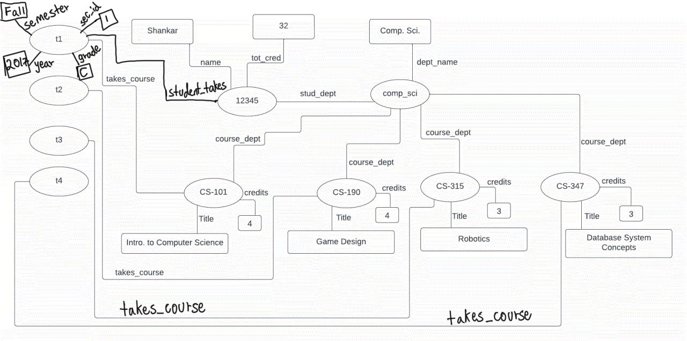

> Provide information about the student named Shankar in our sample university 
> database, including information from the _student_ tuple corresponding to Shankar, 
> the _takes_ tuples corresponding to Shankar and the _course_ tuples corresponding to these 
> _takes_ tuples, in each of the following representations: 
> 
> a. Using JSON, with an appropriate nested representation. 
> 
> b. Using XML, with the same nested representation. 
> 
> c. Using RDF triples. 
>
> d. As an RDF graph. 

--------------------------------

> a. Using JSON, with an appropriate nested representation. 

```json
{
    "id": "12345",
    "name": "Shankar", 
    "dept_name": "Comp. Sci.", 
    "tot_cred": 32, 
    "takes": [
        {
            "sec_id": 1, 
            "semester": "Fall", 
            "year": 2017, 
            "grade": "C", 
            "course": {
                "course_id": "CS-101", 
                "title": "Intro. to Computer Science", 
                "dept_name": "Comp. Sci.", 
                "credits": 4, 
            }
        }, 
        {
            "sec_id": 2, 
            "semester": "Spring", 
            "year": 2017, 
            "grade": "A", 
            "course": {
                "course_id": "CS-190", 
                "title": "Game Design", 
                "dept_name": "Comp. Sci.", 
                "credits": 4, 
            }
        }, 
        {
            "sec_id": 1, 
            "semester": "Spring", 
            "year": 2018, 
            "grade": "A", 
            "course": {
                "course_id": "CS-315", 
                "title": "Robotics", 
                "dept_name": "Comp. Sci.", 
                "credits": 3, 
            }
        },
        {
            "sec_id": 1, 
            "semester": "Fall", 
            "year": 2017, 
            "grade": "A", 
            "course": {
                "course_id": "CS-347", 
                "title": "Database System Concepts", 
                "dept_name": "Comp. Sci.", 
                "credits": 3, 
            }
        },  
    ]
}
```

> b. Using XML, with the same nested representation. 

```xml
<student>
    <id>"12345"</id>
    <name>"Shankar"</name>
    <dept_name>"Comp. Sci."</dept_name>
    <tot_cred>32</tot_cred>
    <takes>
        <take>
            <sec_id>1</sec_id>
            <semester>"Fall"</semester>
            <year>2017</year>
            <grade>"C"</grade>
            <course>
                <course_id>"CS-101"</course_id>
                <title>"Intro. to Computer Science"</title>
                <dept_name>"Comp. Sci."</dept_name>
                <credits>4</credits>
            </course>
        </take>
        <take>
            <sec_id>2</sec_id>
            <semester>"Spring"</semester>
            <year>2017</year>
            <grade>"A"</grade>
            <course>
                <course_id>"CS-190"</course_id>
                <title>"Game Design"</title>
                <dept_name>"Comp. Sci."</dept_name>
                <credits>4</credits>
            </course>
        </take>
        <take>
            <sec_id>1</sec_id>
            <semester>"Spring"</semester>
            <year>2018</year>
            <grade>"A"</grade>
            <course>
                <course_id>"CS-315"</course_id>
                <title>"Robotics"</title>
                <dept_name>"Comp. Sci."</dept_name>
                <credits>3</credits>
            </course>
        </take>
        <take>
            <sec_id>1</sec_id>
            <semester>"Fall"</semester>
            <year>2017</year>
            <grade>"A"</grade>
            <course>
                <course_id>"CS-347"</course_id>
                <title>"Database System Concepts"</title>
                <dept_name>"Comp. Sci."</dept_name>
                <credits>3</credits>
            </course>
        </take>
    </takes>
</student>
```

> c. Using RDF triples. 

```rdf
12345       instance-of          student
12345       name                 "Shankar"
12345       stud_dept            comp_sci
12345       tot_cred             "32"
comp_sci    instance-of          department
comp_sci    dept_name            "Comp. Sci."
CS-101      instance-of          course
CS-101      title                "Intro. to Computer Science"
CS-101      course_dept          comp_sci
CS-101      credits              "4"
CS-190      instance-of          course
CS-190      title                "Game Design"
CS-190      course_dept          comp_sci
CS-190      credits              "4"
CS-315      instance-of          course
CS-315      title                "Robotics"
CS-315      course_dept          comp_sci
CS-315      credits              "3"
CS-347      instance-of          course
CS-347      title                "Database System Concepts"
CS-347      course_dept          comp_sci
CS-347      credits              "3"
t1          instance-of          takes
t1          takes_course         CS-101
t1          sec_id               "1"
t1          semester             "Fall"
t1          year                 "2017"
t2          instance-of          takes
t2          takes_course         CS-190
t2          sec_id               "2"
t2          semester             "Spring"
t2          year                 "2017"
t3          instance-of          takes
t3          takes_course         CS-315
t3          sec_id               "1"
t3          semester             "Spring"
t3          year                 "2018"
t4          instance-of          takes
t4          takes_course         CS-347
t4          sec_id               "1"
t4          semester             "Fall"
t4          year                 "2017"
t1          student_takes        12345
t2          student_takes        12345
t3          student_takes        12345
t4          student_takes        12345
t1          grade                "C"
t2          grade                "A"
t3          grade                "A"
t4          grade                "A"
```


> d. As an RDF graph. 

