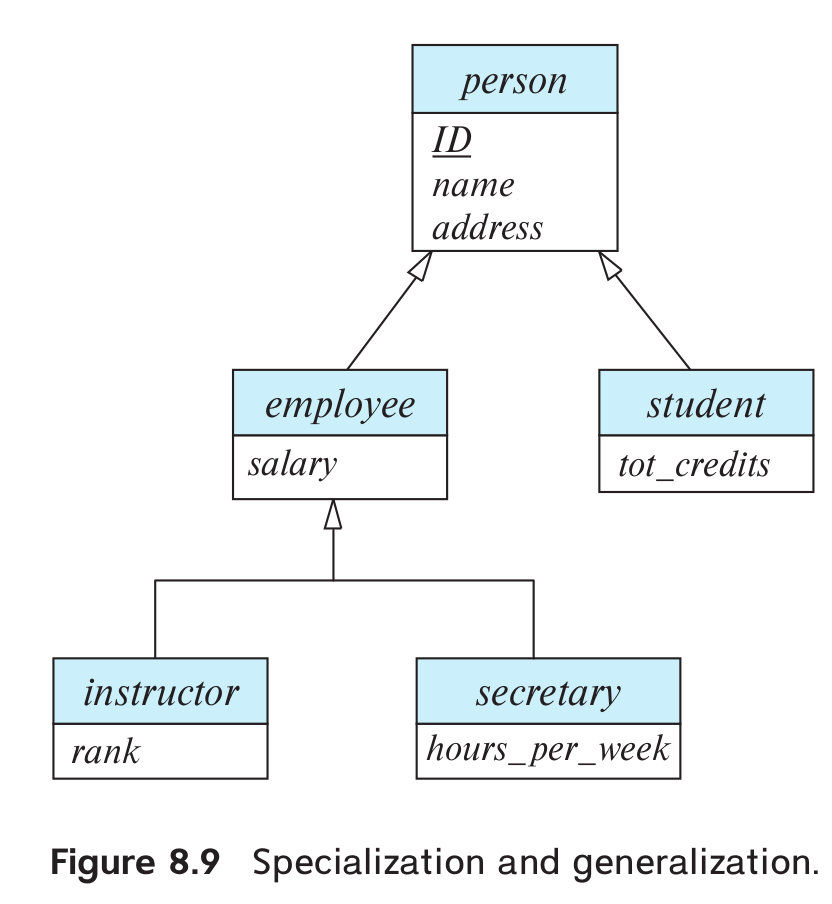

> Consider the E-R diagram in Figure 8.9, which contains specializations,
> using subtypes and subtables. 
> 
> a. Give an SQL schema definition of the E-R diagram. 
> 
> b. Give an SQL query to find the names of all people who are not 
> secretaries. 
> 
> c. Give an SQL query to print the names of people who are neither 
> employees nor students. 
> 
> d. Can you create a person who is an employee and a student with the 
> schema you created? Explain how, or explain why it is not possible. 
> 
> 

--------------------------------

Note that the following are answered using a postgresql server version 13.7.

> a. Give an SQL schema definition of the E-R diagram. 

```sql 
CREATE TABLE person ( 
    id  INTEGER PRIMARY KEY,
    name VARCHAR(50), 
    address VARCHAR(50) 
);

CREATE TABLE employee ( 
    salary NUMERIC(12, 2)
) INHERITS (person);

CREATE TABLE student (
    tot_credits INTEGER
) INHERITS (person); 

-- Since the specialization of `person` to
-- `employee` and `student` is an 
-- overlapping specialization.  
CREATE TABLE employee_and_student ()
 INHERITS (employee, student); 

CREATE TABLE instructor (
    rank INTEGER
) INHERITS (employee);

CREATE TABLE secretary ( 
    hours_per_week INTEGER
) INHERITS (employee); 

-- Note that the specialization of the relation
-- `employee` to `instructor` and `secretary` is 
-- a disjoint specialization. 
```

> b. Give an SQL query to find the names of all people who are not 
> secretaries. 

```sql 
WITH all_people_who_are_not_secretary(id,name) AS ( 
    (SELECT id, name
    FROM person)
    EXCEPT
    (SELECT id, name
    FROM secretary)
)
SELECT name
FROM all_people_who_are_not_secretary;
```

> c. Give an SQL query to print the names of people who are neither 
> employees nor students. 

```sql 
SELECT name 
FROM ONLY person;
```

> d. Can you create a person who is an employee and a student with the 
> schema you created? Explain how, or explain why it is not possible. 

Yes. We can create a person who is both an employee and a student.

To create such an entity, simply perform an insertion into the relation
_employee_and_student_. 

