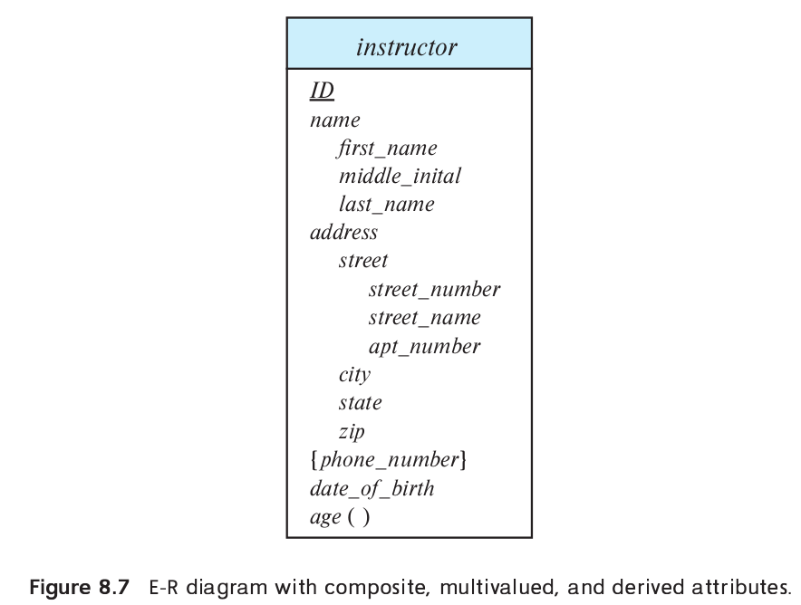

> Consider the E-R diagram in Figure 8.7 showing entity set _instructor_. 
> Give an SQL schema definition corresponding to the E-R diagram, treating
> _phone_number_ as an array of 10 elements, using Oracle or PostgreSQL syntax. 



--------------------------------

The following uses Postgresql. 

```sql 
CREATE TYPE nameType AS ( 
    first_name VARCHAR(15), 
    middle_initial CHAR, 
    last_name VARCHAR(15)
);

CREATE TYPE streetType AS ( 
    street_name VARCHAR(15), 
    street_number VARCHAR(4), 
    apartment_number VARCHAR(7)
);

CREATE TYPE addressType AS (
    street streetType, 
    city VARCHAR(15), 
    state VARCHAR(15), 
    zip_code CHAR(6)
);

CREATE TABLE instructor ( 
    id integer primary key, 
    name nameType, 
    address addressType, 
    phone_number VARCHAR(12)[],
    date_of_birth date
);
```

If you are curious how to insert data into the _instructor_ relation in postgresql, 
use the following: 

```sql 
INSERT INTO instructor VALUES ( 
    1, 
    ('Michael', '-', 'Faraday')::nameType, 
    ((NULL, NULL, NULL)::streetType, 'Newington Butts', 'England', NULL)::addressType,
    ARRAY['+111-555-333', '+333-222-777'], 
    '1791-9-22'
);
```