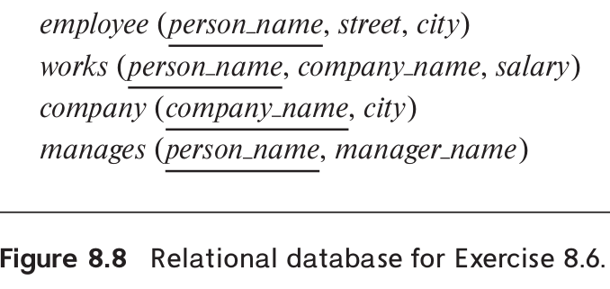

> Consider the relational schema shown in Figure 8.8. 
> 
> a. Give a schema definition in SQL corresponding to the relational schema 
> but using references to express foreign-key relationships. 
> 
> b. Write each of the following queries on the schema, using SQL. 
> 
> i. Find the company with the most employees. 
> 
> ii. Find the company with the smallest payroll. 
> 
> iii. Find those companies whose employees earn a higher salary, on average, 
> than the average salary at First Bank Corporation. 
> 
> 

--------------------------------

> a. Give a schema definition in SQL corresponding to the relational schema 
> but using references to express foreign-key relationships. 

The schema definition is given below. 

```sql 
CREATE TYPE Employee ( 
    person_name VARCHAR(30), 
    street VARCHAR(15), 
    city VARCHAR(15)
);

CREATE TYPE Company ( 
    company_name VARCHAR(15), 
    city VARCHAR(15)
);

CREATE TABLE employee OF Employee;
CREATE TABLE company  OF Company;

CREATE TYPE Works ( 
    person REF(Employee) SCOPE employee, 
    comp REF(Company) SCOPE company, 
    salary INT
);

CREATE TABLE works OF Works;
CREATE TYPE Manages ( 
    person REF(Employee) SCOPE employee, 
    manager REF(Employee) SCOPE employee
);
CREATE TABLE manages OF Manages;
```

> b. Write each of the following queries on the schema, using SQL. 
> 
> i. Find the company with the most employees. 

```sql 
SELECT comp->name
FROM works
GROUP BY comp
HAVING COUNT(person) >= ALL(
    SELECT COUNT(person)
    FROM works
    GROUP BY comp
);
```

> ii. Find the company with the smallest payroll. 

```sql 
SELECT comp->name
FROM works
GROUP BY comp
HAVING SUM(salary) <= ALL(
    SELECT SUM(salary)
    FROM works
    GROUP BY comp
);
```

> iii. Find those companies whose employees earn a higher salary, on average, 
> than the average salary at First Bank Corporation. 

```sql 
SELECT comp->name
FROM works
GROUP BY comp
HAVING AVG(salary) > (
    SELECT AVG(salary)
    FROM works
    WHERE comp->company_name = 'First Bank Corporation'
);
```