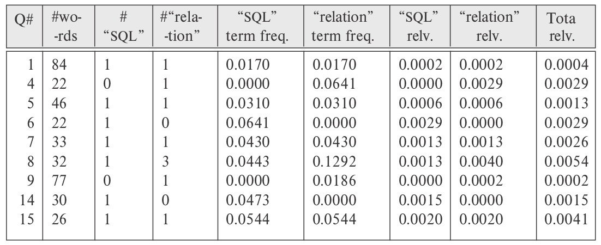

> Compute the relevance (using appropriate definitions of term frequency and 
> inverse document frequency) of each of the Practice Exercises in this chapter
> by the query "SQL relation". 

--------------------------------

We do not consider the questions containing neither of the keywords because 
their relevance to the keywords is zero. The number of words in a question
include stop words. We use the equations given in Section 31.2 to compute 
relevance; the $\log$ term in the equation is assumed to be to the base $2$. 

