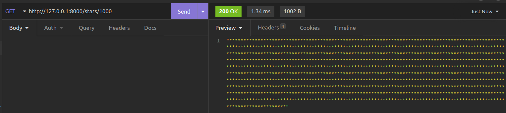
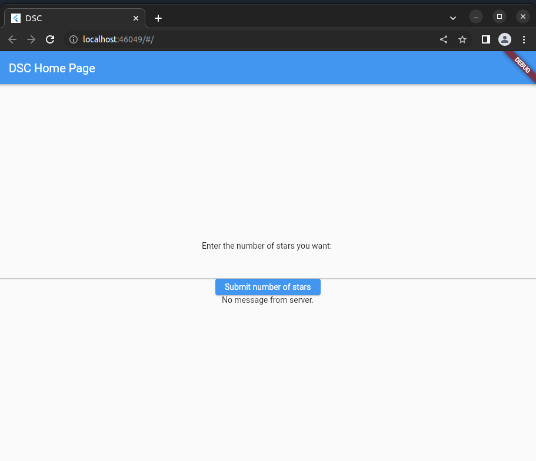
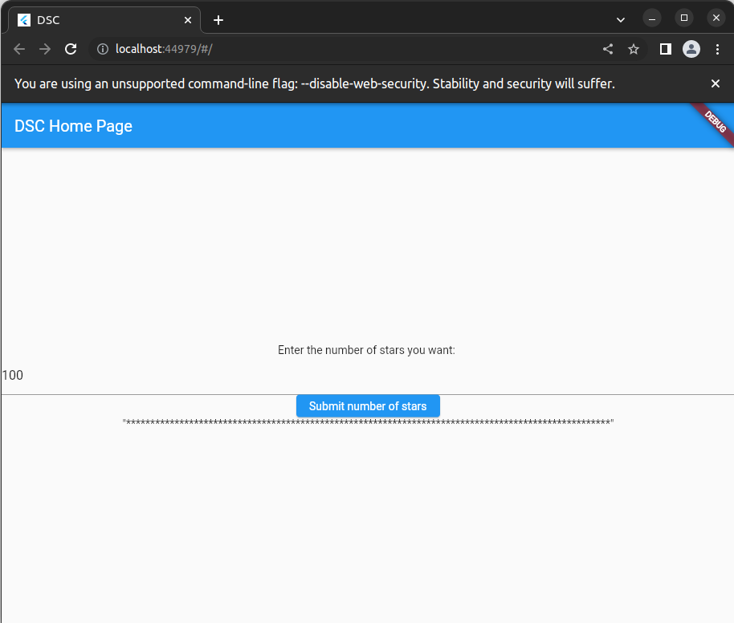
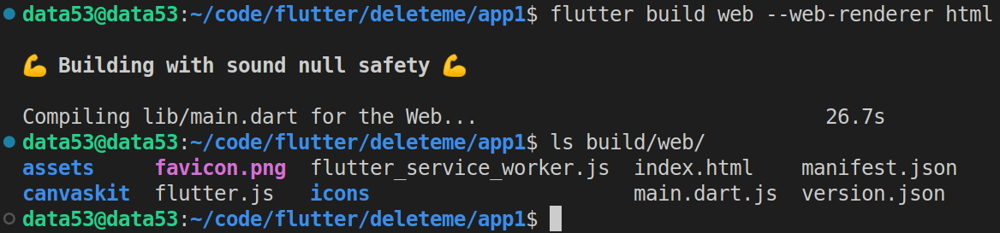

> Write a servlet and associated HTML code for the following very simple 
> application: A user is allowed to submit a form containing a value, say
> $n$, and should get a response containing $n$ "*" symbols. 

--------------------------------

# Python Version: 

The following uses [FastAPI](https://fastapi.tiangolo.com/)

```python
from fastapi import FastAPI
from fastapi.middleware.cors import CORSMiddleware

app = FastAPI()

app.add_middleware(
    CORSMiddleware,
    allow_origins=["*"],
    allow_methods=["GET"],
    allow_headers=["*"],
)

@app.get("/stars/{n}")
def get_stars(n: int): 
    return "*" * n
```

Run your api: 

```
uvicorn main:app --reload
```


Test it in [insomnia](https://insomnia.rest/)



I would write the frontend with [flutter](https://flutter.dev/) and let the flutter engine 
compile the dart code to HTML for me.

```dart
import 'package:flutter/foundation.dart';
import 'package:flutter/material.dart';
import 'package:http/http.dart' as http;


void main() {
  runApp(const MyApp());
}

class MyApp extends StatelessWidget {
  const MyApp({super.key});

  @override
  Widget build(BuildContext context) {
    return MaterialApp(
      title: 'DSC',
      theme: ThemeData(
        primarySwatch: Colors.blue,
      ),
      home: const MyHomePage(title: 'DSC Home Page'),
    );
  }
}

class MyHomePage extends StatefulWidget {
  const MyHomePage({super.key, required this.title});

  final String title;

  @override
  State<MyHomePage> createState() => _MyHomePageState();
}

class _MyHomePageState extends State<MyHomePage> {
  late TextEditingController tec;
  String msg = "No message from server.";

  @override
  void initState() {
    tec = TextEditingController();
    super.initState();
  }

  @override
  void dispose() {
    tec.dispose();
    super.dispose();
  }

  @override
  Widget build(BuildContext context) {
    return Scaffold(
      appBar: AppBar(
        title: Text(widget.title),
      ),
      body: Center(
        child: Column(
          mainAxisAlignment: MainAxisAlignment.center,
          children: <Widget>[
            const Text("Enter the number of stars you want: "),
            TextFormField(
              controller: tec, 
            ), 
            ElevatedButton(
              child: Text("Submit number of stars"), 
              onPressed: () { 
                
                try { 
                  int number_of_stars = int.parse(tec.text);
                  http.get(Uri.parse("http://127.0.0.1:8000/stars/$number_of_stars")).then(
                    (http.Response r) { 
                      setState(() {
                        msg = r.body;
                      });
                    }
                  );
                } catch (e) { 
                  ScaffoldMessenger.of(context).showSnackBar(
                    const SnackBar(content: Text("Some error occured! that is all we know."))
                  );
                }
              }
            ), 
            Text(msg),
          ],
        ),
      ),

    );
  }
}
```

Initial Screenshot: 



After submitting a value: 




Compile: 



# Servlet version: 

```java
// TODO. 
```

