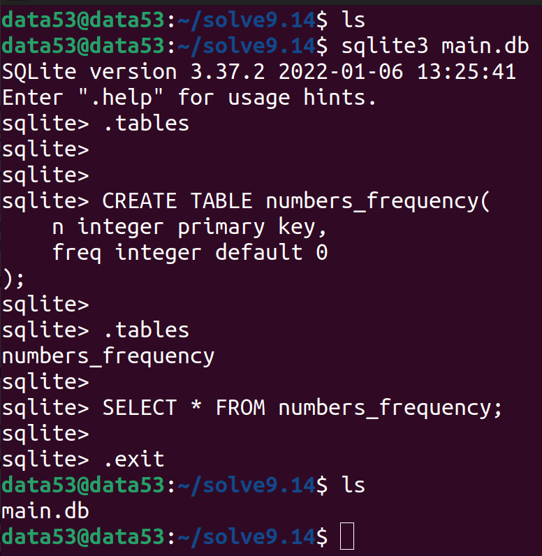

> Write a servlet and associated HTML code for the following simple 
> application: A user is allowed to submit a form containing a number, 
> say $n$, and should get a response saying how many times the value $n$ has 
> been submitted previously. The number of times each value has been submitted
> previously should be stored in a database. 

--------------------------------

# Python Version: 

We will use the [sqlite](https://www.sqlite.org/index.html) database and [sqlite3](https://docs.python.org/3/library/sqlite3.html) python module.

The following is the schema of the database (let's assume its name is `main.db`): 

```sql 
CREATE TABLE numbers_frequency(
    n integer primary key, 
    freq integer default 0
);
```

Creating the database: 



The following is the code of our backend: 

```python
from fastapi import FastAPI
import sqlite3

app = FastAPI()
DB_NAME = "main.db"

@app.get("/submit")
def submit_a_number(n: int): 
    con = sqlite3.connect(DB_NAME)
    cur = con.cursor()

    res = cur.execute("SELECT * FROM numbers_frequency WHERE n = ?", (n,))
    data = res.fetchone()
    retval = dict() 

    if data is None: 
        # this is the first time the number is submitted
        # so insert it. 
        cur.execute("INSERT INTO numbers_frequency VALUES (?, 1)", (n,))
        retval.update({"freq": 1})

    else: 
        cur.execute("UPDATE numbers_frequency SET freq = ? WHERE n = ?", (data[1]+1, n))
        retval.update({"freq": data[1]+1})

    con.commit()
    con.close()
    return retval
```

Start your server (note that `x.py` holds the python code given above): 


Use Insomnia to send requests: 

Request 1: 

Request 2: 

Request 3: 

Request 4: 


I would write the frontend with [flutter](https://flutter.dev/) and let the flutter engine 
compile the dart code to HTML for me.

```dart
import 'package:flutter/foundation.dart';
import 'package:flutter/material.dart';
import 'package:http/http.dart' as http;


void main() {
  runApp(const MyApp());
}

class MyApp extends StatelessWidget {
  const MyApp({super.key});

  @override
  Widget build(BuildContext context) {
    return MaterialApp(
      title: 'DSC Q 9.14',
      theme: ThemeData(
        primarySwatch: Colors.blue,
      ),
      home: const MyHomePage(title: 'DSC Question 9.14'),
    );
  }
}

class MyHomePage extends StatefulWidget {
  const MyHomePage({super.key, required this.title});

  final String title;

  @override
  State<MyHomePage> createState() => _MyHomePageState();
}

class _MyHomePageState extends State<MyHomePage> {
  late TextEditingController tec;
  String msg = "No message from server.";

  @override
  void initState() {
    tec = TextEditingController();
    super.initState();
  }

  @override
  void dispose() {
    tec.dispose();
    super.dispose();
  }

  @override
  Widget build(BuildContext context) {
    return Scaffold(
      appBar: AppBar(
        title: Text(widget.title),
      ),
      body: Center(
        child: Column(
          mainAxisAlignment: MainAxisAlignment.center,
          children: <Widget>[
            const Text("Enter the number of you want to send: "),
            TextFormField(
              controller: tec, 
            ), 
            ElevatedButton(
              child: Text("Submit"), 
              onPressed: () { 
                
                try { 
                  int n = int.parse(tec.text);
                  http.get(Uri.parse("http://127.0.0.1:8000/submit?n=$n")).then(
                    (http.Response r) { 
                      setState(() {
                        msg = r.body.toString();
                      });
                    }
                  );
                } catch (e) { 
                  ScaffoldMessenger.of(context).showSnackBar(
                    const SnackBar(content: Text("Some error occured! that is all we know."))
                  );
                }
              }
            ), 
            Text(msg),
          ],
        ),
      ),

    );
  }
}
```

Don't forget to disable [CORS](https://pub.dev/packages/flutter_cors) as in exercise 9.13 using the following command: 

```bash
fluttercors --disable
```

Inital screen: 


After submitting the number 5: 


Compile: 


**WARNING** The code of the backend given above has 2 major problems: 
1. It opens and closes a connection to the database during every HTTP GET request. 
2. The system might incorrectly increment the frequency of a given number because of 
race conditions. To solve this we need to use Database Transactions.

I will leave this as a TODO for the future. Also, if anybody is up for the challenge 
send a pull request and I am ready to merge. 

# Servlet version: 

```java
// TODO
```

