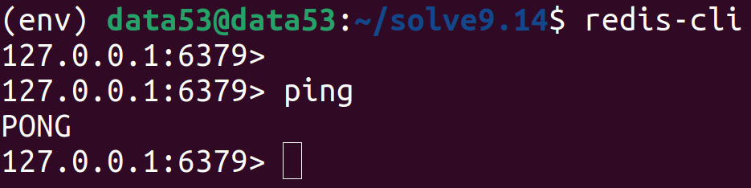
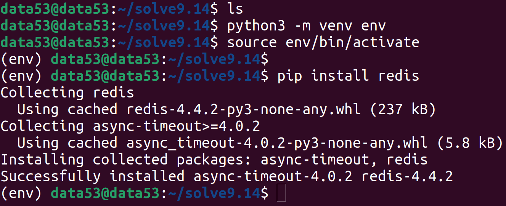
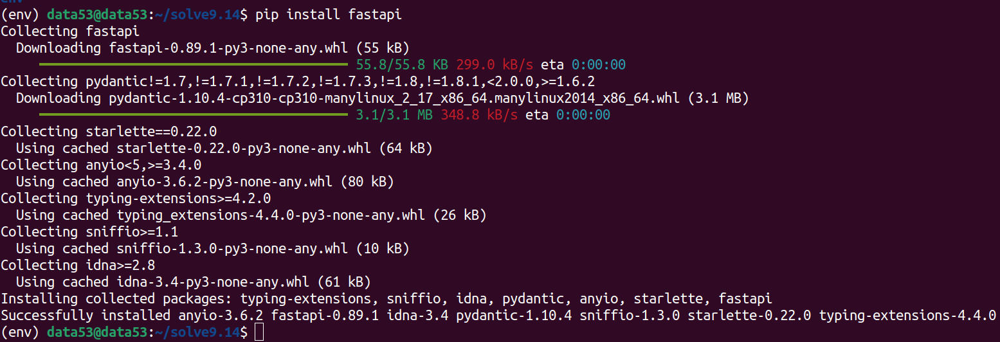
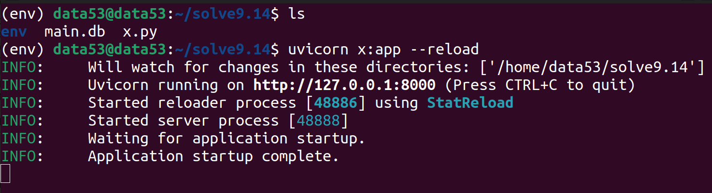
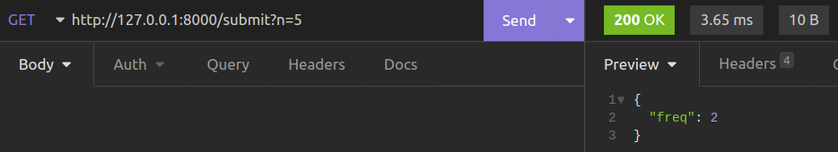
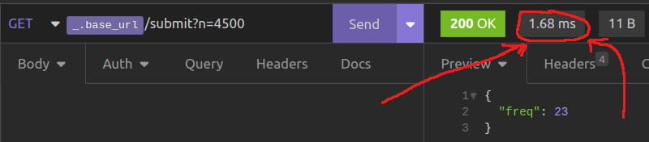
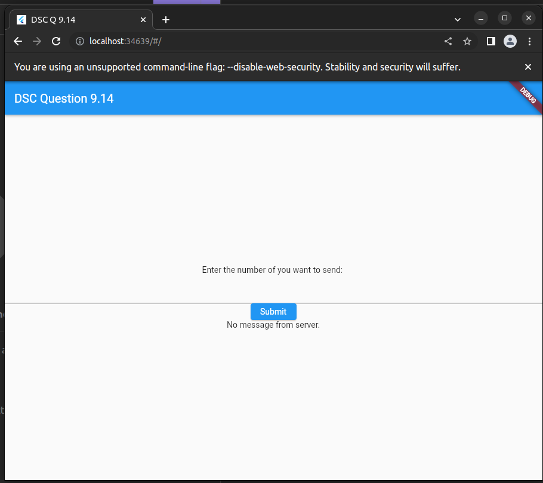

> Write a servlet and associated HTML code for the following simple 
> application: A user is allowed to submit a form containing a number, 
> say $n$, and should get a response saying how many times the value $n$ has 
> been submitted previously. The number of times each value has been submitted
> previously should be stored in a database. 

--------------------------------

# Python Version: 

We will use the [Redis](https://redis.io/) database and [redis-py](https://github.com/redis/redis-py) python module.


Make sure Redis is installed on your machine : 



If Redis is not installed on your machine head on over to [redis.io](https://redis.io/docs/getting-started/). 


Install the **redis-py** module: 




Then install fastapi: 



The following is the code of our backend: 

```python
from fastapi import FastAPI, Depends
from fastapi.middleware.cors import CORSMiddleware

import redis

app = FastAPI()

# to learn more about the following: 
# https://fastapi.tiangolo.com/tutorial/cors/
app.add_middleware(
    CORSMiddleware,
    allow_origins=["*"],
    allow_methods=["GET"],
    allow_headers=["*"],
)

# dependency with yield
# to learn more about the following:
# https://fastapi.tiangolo.com/tutorial/dependencies/dependencies-with-yield/
def get_db(): 
    db = redis.Redis(host='localhost', port=6379, db=0)
    try: 
        yield db
    finally: 
        db.close()

@app.get("/submit")
def submit_a_number(n: int, db: redis.Redis = Depends(get_db)): 
    # if you want to learn more about INCR command of redis 
    # head on over to: https://redis.io/commands/incr/
    return { 
        "freq": db.incr(n)
    }
```

The following is taken from the documentation of redis: 

> What does it mean that INCR is atomic? That even multiple clients issuing INCR against the same key will never enter into a race condition. For instance, it will never happen that client 1 reads “10”, client 2 reads “10” at the same time, both increment to 11, and set the new value to 11. The final value will always be 12 and the read-increment-set operation is performed while all the other clients are not executing a command at the same time. 


Start your server (note that `x.py` holds the python code given above): 



Use Insomnia to send requests: 

Request 1: 

Request 2: 

Request 3: 

Request 4: 


Note: The above insomnia sessions were requesting an older version 
of the backend app that used sqlite instead of redis. That is why 
you see a response time $> 2 \text{ms}$. When using redis, response 
times around $1.8 \text{ms}$ are normal. Example: 



I would write the frontend with [flutter](https://flutter.dev/) and let the flutter engine 
compile the dart code to HTML for me.

```dart
import 'dart:convert';

import 'package:flutter/material.dart';
import 'package:http/http.dart' as http;

void main() {
  runApp(const MyApp());
}

class MyApp extends StatelessWidget {
  const MyApp({super.key});

  @override
  Widget build(BuildContext context) {
    return MaterialApp(
      title: 'DSC Q 9.14',
      theme: ThemeData(
        primarySwatch: Colors.blue,
      ),
      home: const MyHomePage(title: 'DSC Question 9.14'),
    );
  }
}

class MyHomePage extends StatefulWidget {
  const MyHomePage({super.key, required this.title});

  final String title;

  @override
  State<MyHomePage> createState() => _MyHomePageState();
}

class _MyHomePageState extends State<MyHomePage> {
  late TextEditingController tec;
  String msg = "No message from server.";

  @override
  void initState() {
    tec = TextEditingController();
    super.initState();
  }

  @override
  void dispose() {
    tec.dispose();
    super.dispose();
  }

  @override
  Widget build(BuildContext context) {
    return Scaffold(
      appBar: AppBar(
        title: Text(widget.title),
      ),
      body: Center(
        child: Column(
          mainAxisAlignment: MainAxisAlignment.center,
          children: <Widget>[
            const Text("Enter the number you want to send: "),
            TextFormField(
              controller: tec,
            ),
            ElevatedButton(
                child: const Text("Submit"),
                onPressed: () {
                  try {
                    int n = int.parse(tec.text);
                    http
                        .get(Uri.parse("http://127.0.0.1:8000/submit?n=$n"))
                        .then(
                      (http.Response r) {
                        String body = r.body;
                        Map<String, dynamic> data = jsonDecode(body);
                        int freq = data["freq"] as int;
                        setState(
                          () {
                            msg =
                                "The number $n has been submitted $freq times.";
                          },
                        );
                      },
                    );
                  } catch (e) {
                    ScaffoldMessenger.of(context).showSnackBar(const SnackBar(
                        content:
                            Text("Some error occured! that is all we know.")));
                  }
                }),
            Text(msg),
          ],
        ),
      ),
    );
  }
}

```

Inital screen: 


After submitting the number 5: 


Compile: 


# Servlet version: 

```java
// TODO
```

