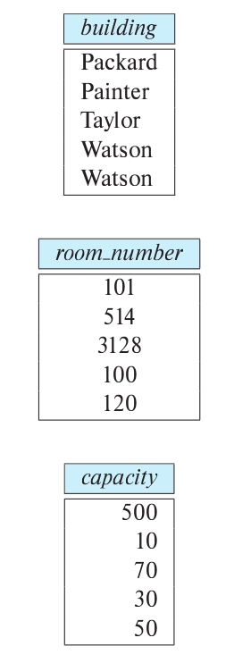

> Draw a diagram that shows how the _classroom_ relation of our university schema as shown 
> in Appendix A would be stored under a column-oriented storage structure. 

--------------------------------

The relation would be stored in three files, one per attribute, as shown below. 
We assume that the row number can be inferred implicitly from position, by using 
fixed-size space for each attribute. Otherwise, the row number would also have 
to be stored explicitly. 

