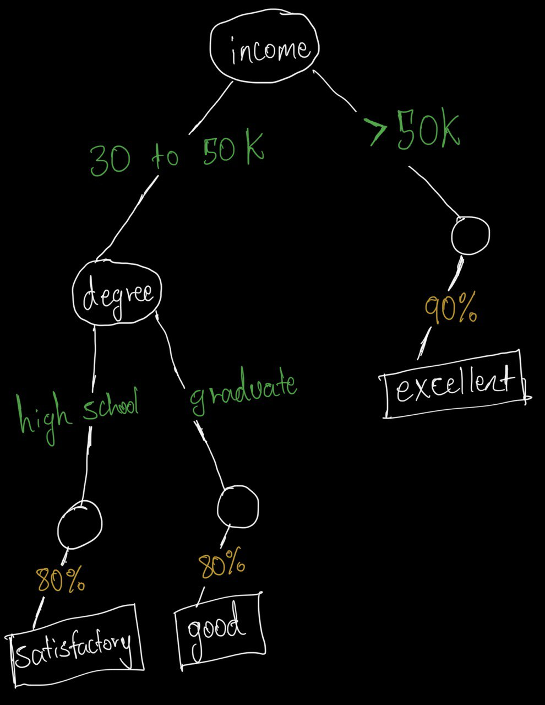

> Classification can be done using _classification rules_, which have a _condition_, 
> a _class_, and a _confidence_; the confidence is the percentage of the inputs satisfying
> the condition that fall in the specified class. 
> 
> For example, a classification rule for credit ratings may have a condition that salary 
> is between $30,000 and $50,000, and education level is graduate, with the credit rating 
> class of _good_, and a confidence of 80%. A second rule may have a condition that 
> salary is between $30,000 and $50,000, and education level is high-school, with the 
> credit rating class of _satisfactory_, and a confidence of 80%. A third rule may have 
> a condition that salary is above $50,001, with the credit rating class of _excellent_, 
> and a confidence of 90%. Show a decision tree classifier corresponding to the above 
> rules. 
> 
> Show how the decision tree classifier can be extended to record the confidence values. 

--------------------------------

