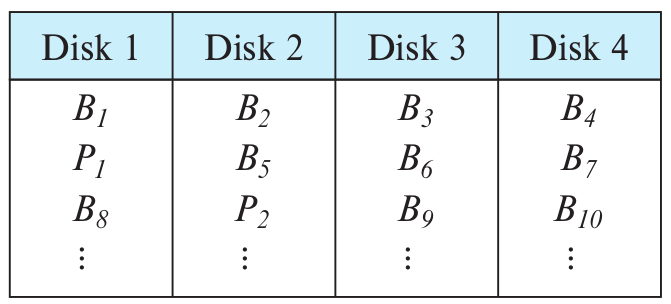

> Consider the following data and parity-block arrangement on four disks: 
> 
> 
> 
> The $B_i$ s represent data blocks; the $P_i$ s represent parity blocks. Parity block
> $P_i$ is the parity block for data blocks $B_{4i-3}$ to $B_{4i}$. What, if any, 
> problem might this arrangement present?

--------------------------------

This arrangement has the problem that $P_i$ and $B_{4i-3}$ are on the same disk. So if 
that disk fails, reconstruction of $B_{4i-3}$ is not possible, since data and parity 
are both lost. 