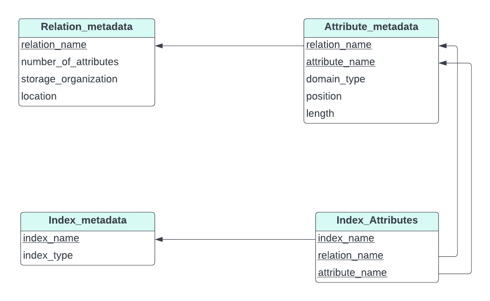

> Give a normalized version of the <i>Index_metadata</i> relation, and 
> explain why using the normalized version would result in worse performance. 

--------------------------------

The above schema will result in worse performance, because given an **index_name**
we would have to perform a join with the relation **Index_Attributes** every time
we want to see the attributes that are associated with that index. 

Note that the above schema is in first normal form. Normalizing it further, to BCNF
will result in a more even worse schema in the eyes of performance. It is not in 
BCNF because of the functional dependency <i>index_name</i> $\twoheadrightarrow$ <i>relation_name</i>
in the table **Index_Attributes**.