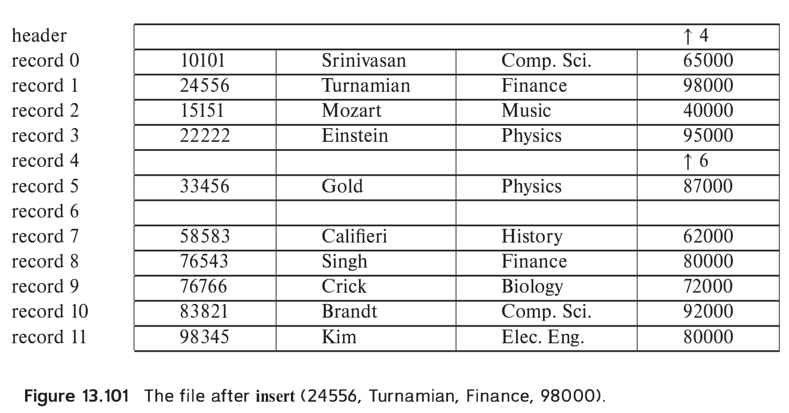
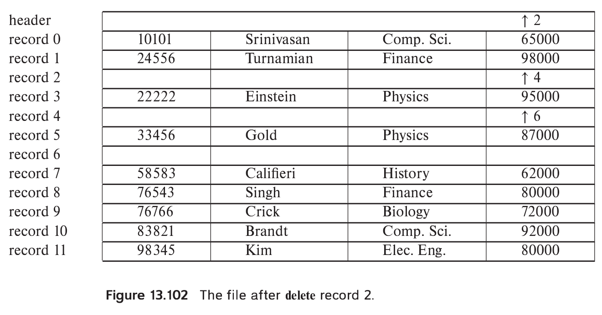
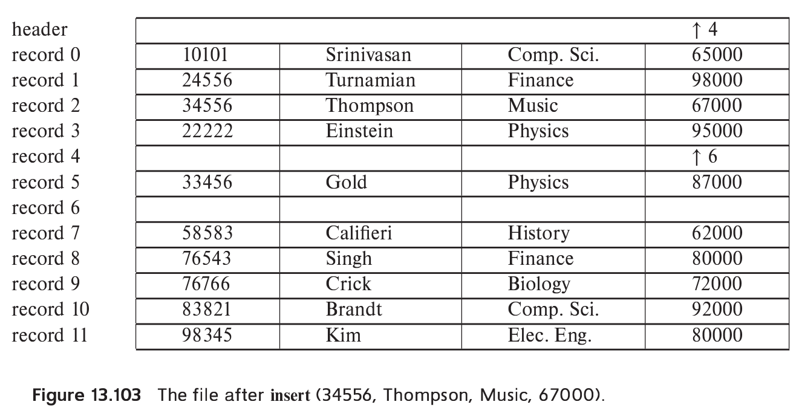

> Show the structure of the file of Figure 13.4 after each of the following steps: 
> 
> a. Insert(24556, Turnamian, Finance, 98000). 
> 
> b. Delete record 2. 
> 
> c. Insert (34556, Thompson, Music, 67000). 

--------------------------------
We use "$\uparrow i$" to denote a pointer to record "$i$". 

> a. Insert(24556, Turnamian, Finance, 98000). 

> b. Delete record 2. 

Note that the free record chain could have alternatively been from the header to 
4, from 4 to 2, and finally from 2 to 6. 

> c. Insert (34556, Thompson, Music, 67000). 

