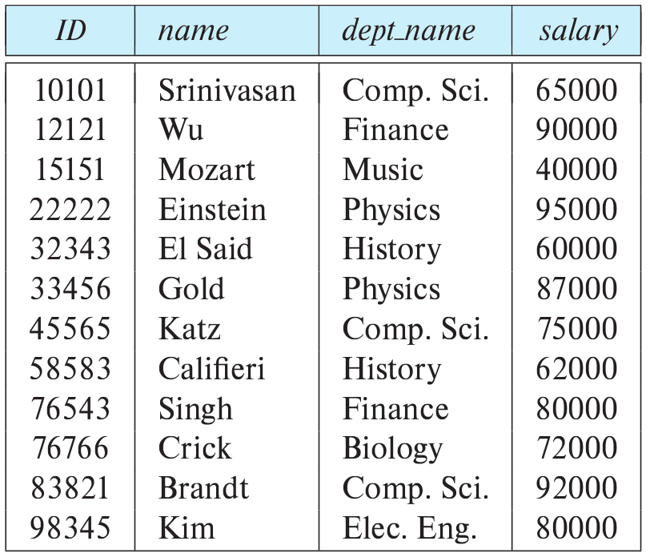
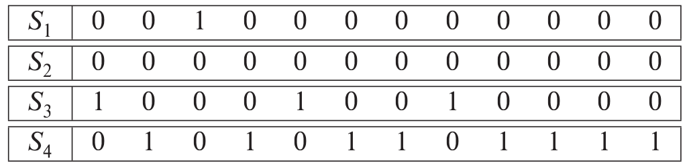
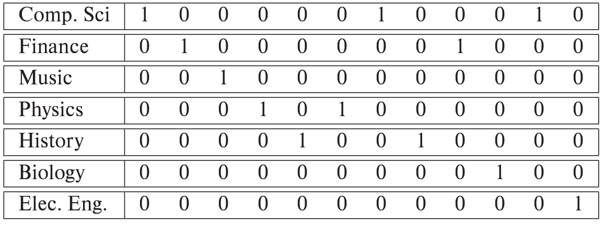
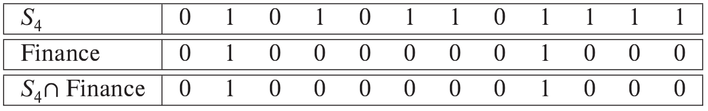

> Consider the _instructor_ relation shown in Figure 14.1. 
> 
> a. Construct a bitmap index on the attribute _salary_, dividing _salary_ values 
> into four ranges; below $50,000$, $50,000$ to below $60,000$, $60,000$ to below $70,000$, 
> and $70,000$ and above. 
> 
> b. Consider a query that requests all instructors in the Finance department with a 
> salary of $80,000$ or more. Outline the steps in answering the query, and show the final 
> and intermediate bitmaps constructed to answer the query. 

--------------------------------

We reproduce the instructor relation below: 

> a. Construct a bitmap index on the attribute _salary_, dividing _salary_ values 
> into four ranges; below $50,000$, $50,000$ to below $60,000$, $60,000$ to below $70,000$, 
> and $70,000$ and above. 

Bitmaps for _salary_, with $S_1$, $S_2$, $S_3$ and $S_4$ representing the given intervals 
in the same order. 

> b. Consider a query that requests all instructors in the Finance department with a 
> salary of $80,000$ or more. Outline the steps in answering the query, and show the final 
> and intermediate bitmaps constructed to answer the query. 

The question is a bit trivial if there is no bitmap on the _dept_name_ attribute. The bitmap for 
the _dept_name_ attribute is: 

To find all instructors in the Finance department with salary of $80,000$ or more, we first 
find the intersection of the Finance department bitmap and $S_4$ bitmap of _salary_ and then scan 
on these records for salary of $80,000$ or more. 

Intersection of Finance department bitmap and $S_4$ bitmap of _salary_: 

Scan on these records with salary $80,000$ or more gives Wu and Singh as the instructors who 
satisfy the given query. 