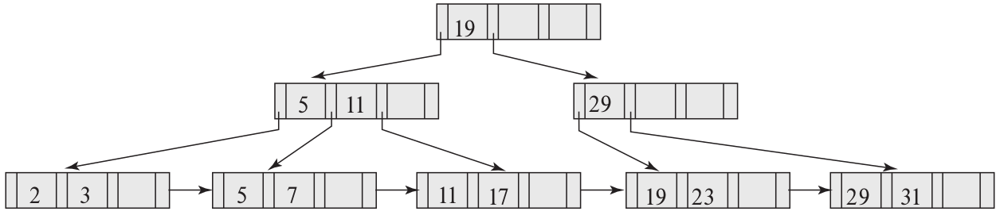

> For each B+-tree of Exercise 14.3, show the steps involved in the following 
> queries: 
> 
> a. Find records with a search-key value of 11. 
> 
> b. Find records with a search-key value between 7 and 17, inclusive. 

--------------------------------

The steps involved for the first B+-tree of Exercise 14.3 is given below: 

> a. Find records with a search-key value of 11. 

We first look at the root node. We see that it only has 
one key value and that is 19. Since 11 < 19, we go to 
the first child of the root node. We see that this child 
contains the keys 5 and 11. Since $11 \geq 11$ we follow
the third pointer from that node, taking us to the leaf node
that contains the entries $11$ and $17$. Following the first
pointer from this leaf node, we get the record that contains
the search-key value of 11. 

> b. Find records with a search-key value between 7 and 17, inclusive. 

We first look at the root node. We see that it only has 
one key value and that is 19. Since 7 < 19, we go to 
the first child of the root node. We see that this child 
contains the keys 5 and 11. Since $5 \leq 7 < 11$ we follow
the second pointer from that node, taking us to the leaf node
that contains the entries $5$ and $7$. Since $5$ is not in the 
range that we want, we leave it. Since $7$ is in the range that 
we want, we add the record pointed by the second pointer in the 
leaf node to our result set. 

We next move to the next leaf node. 

This leaf node contains the search-key values $11$ and $17$. Since both
are in the range that we want we add the records pointed by the pointers
in this leaf node to our result set. 

We the move to the next leaf node. 

The next leaf node has $19$ as its first search-key value. Since $19 > 17$, 
we stop and return our result set. 