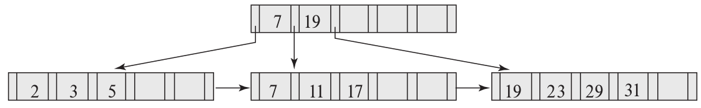
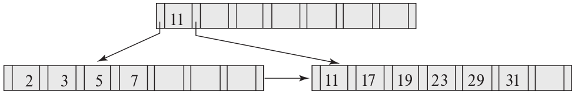

> Construct a B+-tree for the following set of key values: 
> $$
> (2, 3, 5, 7, 11, 17, 19, 23, 29, 31)
> $$
> Assume that the tree is initially empty and values are added in 
> ascending order. Construct B+-trees for the case where the number
> of pointers that will fit in one node is as follows: 
> 
> a. Four
> 
> b. Six
> 
> c. Eight 

--------------------------------

The following were generated by inserting values into the B+-tree in ascending
order. A node (other than the root) was never allowed to have fewer than 
$\lceil n / 2 \rceil$ values/pointers. 

> a. Four

> b. Six

> c. Eight 

TODO: change the above 3 pngs into an animated gif that shows the insertion step by step.

If you want to play with B+-tree animation, head on over to: [B+ tree animation](https://dichchankinh.com/~galles/visualization/BPlusTree.html).