> For each B+-tree of Exercise 14.3, show the form of the tree after each of 
> the following series of operations: 
> 
> a. Insert 9. 
> 
> b. Insert 10. 
> 
> c. Insert 8. 
> 
> d. Delete 23. 
> 
> e. Delete 19. 

--------------------------------

* With structure Exercise 14.3a. 

Insert 9: 

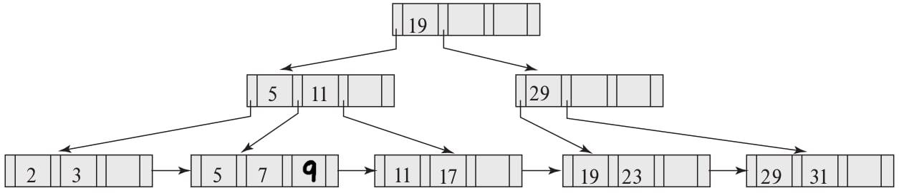

Insert 10: 

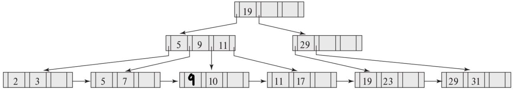

Insert 8: 

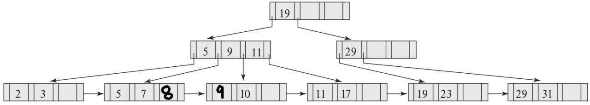

Delete 23: 

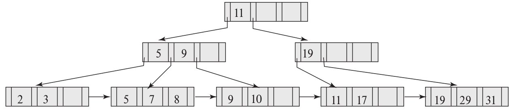

Delete 19: 

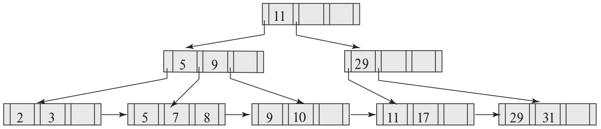

* With structure Exercise 14.3b.

Insert 9: 

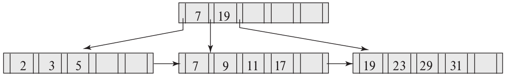

Insert 10: 

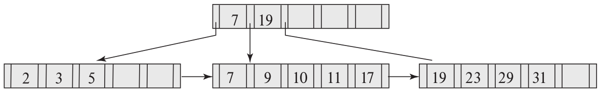

Insert 8: 

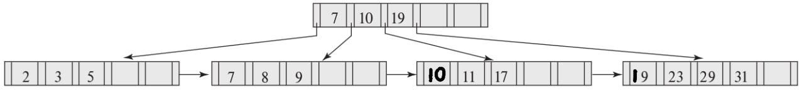

Delete 23: 

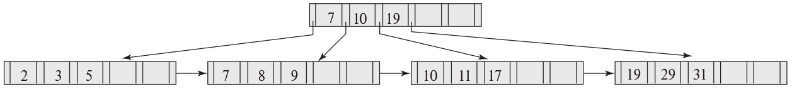

Delete 19: 

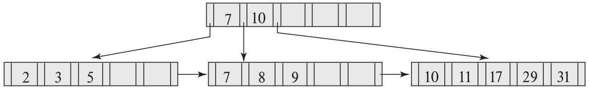

* With structure Exercise 14.3c.

Insert 9: 

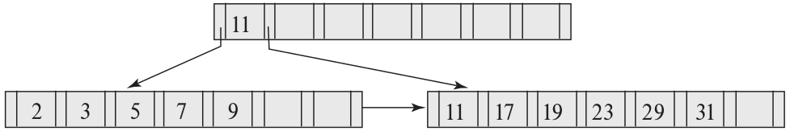

Insert 10: 

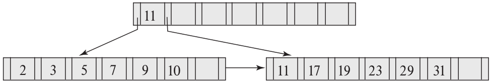

Insert 8: 

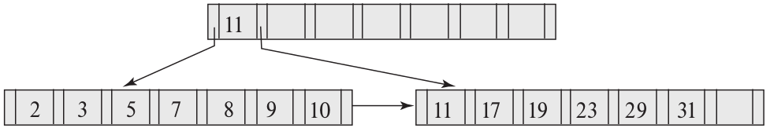

Delete 23: 

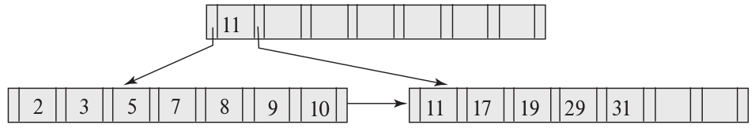

Delete 19: 

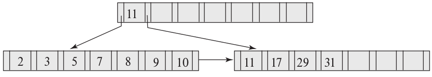

If you want to play with B+-tree animation, head on over to: [B+ tree animation](https://dichchankinh.com/~galles/visualization/BPlusTree.html).