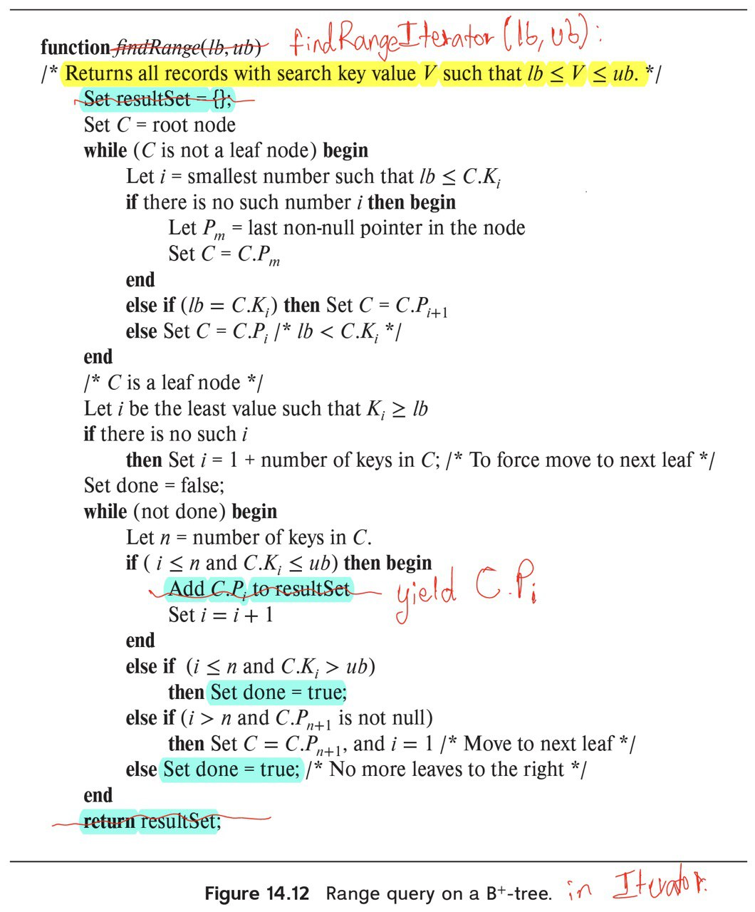

> Give pseudocode for a B+-tree function `findRangeIterator()`, which is like the 
> function `findRange()`, except that it returns an iterator object, as described in 
> Section 14.3.2. Also give pseudocode for the iterator class, including the 
> variables in the iterator object, and the `next()` method. 

--------------------------------

If you want to learn more about the magic of Python Generators, head on over to [python.org](https://docs.python.org/3/tutorial/classes.html#generators).

