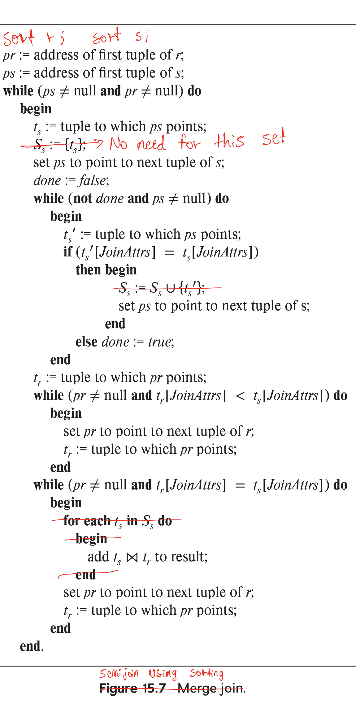

> Consider the following extended relational-algebra operators. Describe how to 
> implement each operation using sorting and using hashing. 
> 
> a. **Semijoin** ($\ltimes_\theta$): The multiset semijoin operator $r \ltimes_\theta s$
> is defined as follows: if a tuple $r_i$ appears $n$ times in $r$, it appears $n$ times in 
> the result of $r \ltimes_\theta s$ if there is at least one tuple $s_j$ such that 
> $r_i$ and $s_j$ satisfy predicate $\theta$; otherwise $r_i$ does not appear in the result. 
> 
> b. **Anti-semijoin** ($\overline{\ltimes}_\theta$): The multiset anti-semijoin operator 
> $r \overline{\ltimes}_\theta s$ is defined as follows: if a tuple $r_i$ appears $n$ times 
> in $r$, it appears $n$ times in the result of $r \overline{\ltimes}_\theta s$ if there does 
> not exist any tuple $s_j$ in $s$ such that $r_i$ and $s_j$ satisfy predicate $\theta$; otherwise
> $r_i$ does not appear in the result. 

--------------------------------

As in the case of join algorithms, semijoin and anti-semijoin can be done efficiently 
if the join conditions are equijoin conditions. We describe below how to efficiently handle 
the case of equijoin conditions using sorting and hashing. With arbitrary join conditions, sorting
and hashing cannot be used; (block) nested loop join needs to be used instead. 

a. **Semijoin**: 

* **Semijoin using sorting**: Sort both $r$ and $s$ on the join attributes in $\theta$. Perform
a scan of both $r$ and $s$ similar to the _Merge-Join Algorithm_ (read section 15.5.4.1) and 
add tuples of $r$ to the result whenever the join attributes of the current tuples of $r$ and $s$
match. The following modifies pseudocode of the _Merge-Join Algorithm_ given in the book to work for
Semijoin:

* **Semijoin using hashing**: Create a hash index in $s$ on the join attributes in $\theta$. 
Iterate over $r$, and perform a hash lookup in $s$. If the hash lookup returns a value, add 
the current tuple of r to the result. 
Note that if $r$ and $s$ are large, they can be partitioned on the join attributes first and the 
above procedure applied on each partition. If $r$ is small but $s$ is large, a hash index can 
be built on $r$ and probed using $s$; and if an $s$ tuple matches an $r$ tuple, the $r$ tuple and all
of its $n$ copies can be output and deleted from the hash index. 

b. **Anti-semijoin**: 

* **Anti-semijoin using sorting**: Sort both $r$ and $s$ on the join attributes in $\theta$. 
Perform a scan of both $r$ and $s$ similar to the merge algorithm and add tuples of $r$ to the 
result if no tuple of $s$ satisfies the join predicate for the corresponding tuple of $r$. 

* **Anti-semijoin using hashing**: Create a hash index in $s$ on the join attributes in 
$\theta$. Iterate over $r$, and for each distinct value of the join attributes, perform 
a hash lookup in $s$. If the hash lookup returns a null value, add the current tuple of $r$
to the result. 
As for semijoin, partitioning can be used if $r$ and $s$ are large. An index on $r$ can be
used instead of an index on $s$, but then when an $s$ tuple matches an $r$ tuple, the $r$
tuple is deleted from the index. After processing all $s$ tuples, all remaining $r$ tuples in the 
index are output as the result of the anti-semijoin operation. 