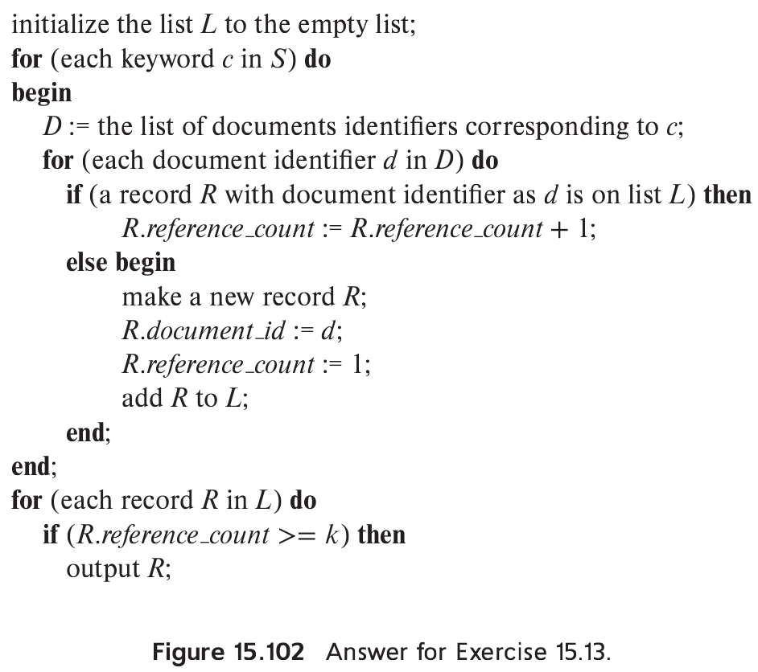

> Suppose you want to find documents that contain at least $k$ of a given set 
> of $n$ keywords. Suppose also you have a keyword index that gives you a 
> (sorted) list of identifiers of documents that contain a specified keyword. Give 
> an efficient algorithm to find the desired set of documents. 

--------------------------------

Let $S$ be a set of $n$ keywords that we are given. An algorithm to find all documents 
that contain at least $k$ of these keywords is given below: 

This algorithm calculates a reference count for each document identifier. A reference 
count of $i$ for a document identifier $d$ means that at least $i$ of the keywords in $S$ 
occur in the document identified by $d$. The algorithm maintains a list of records, each 
having two fields - a document identifier, and the reference count for this identifier. 
This list is maintained sorted on the document identifier field. 

Note that execution of the second **for** statement causes the list $D$ to "merge" with the 
list $L$. Since the lists $L$ and $D$ are sorted, the time taken for this merge is proportional 
to the sum of the lengths of the two lists. Thus the algorithm runs in time (at most) proportional 
to $n$ times the sum total of the number of document identifiers corresponding to each keyword 
in $S$. 