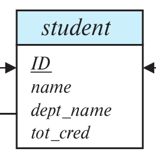
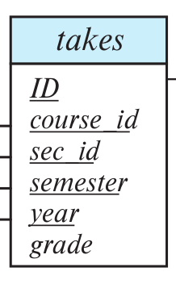

> Consider the following queries. For each query, indicate if column-oriented storage is likely
> to be beneficial or not, and explain why. 
> 
> a. Fetch _ID_, _name_, and _dept_name_ of the student with ID 12345. 
> 
> b. Group the _takes_ relation by _year_ and _course_id_, and find the total number of 
> students for each _(year,course_id)_ combination. 

--------------------------------

> a. Fetch _ID_, _name_, and _dept_name_ of the student with ID 12345. 

I argue that column-oriented storage  **IS NOT** beneficial here. 

Recall the _student_ schema shown below: 

Notice that we are accessing almost all of the attributes of the relation. And as we all 
know constructing a tuple in column-oriented storage is costly. Thus I think row-oriented 
storage with an index on ID would outperform a column-oriented storage on this operation. 

> b. Group the _takes_ relation by _year_ and _course_id_, and find the total number of 
> students for each _(year,course_id)_ combination. 

I argue that column-oriented storage **IS** beneficial here. 

Recall the _takes_ schema shown below: 

Since we might have the edge case where a single student might take a course twice in a given 
year, to perform our desired operation, we only need to look at the attributes _ID_, _course_id_ 
and _year_. Thus we do not even need to look at half of the other attributes (<i>sec_id, 
semester, grade</i>) if we are using a column-oriented storage. If we are using a row-oriented 
storage on the other hand we would be forced to buffer all of the attributes into memory even though 
we do not even need half of them.  Thus I think column-oriented storage would outperform a 
row-oriented storage on this operation.
