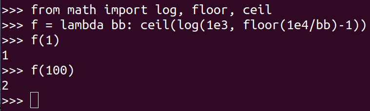

> Suppose you need to sort a relation of 40 gigabytes, with 4-kilobyte blocks, using a
> memory size of 40 megabytes. Suppose the cost of a seek is 5 milliseconds, while the 
> disk transfer rate is 40 megabytes per second. 
> 
> a. Find the cost of sorting the relation, in seconds, with $b_b = 1$ and with $b_b = 100$. 
> 
> b. In each case, how many merge passes are required?
> 
> c. Suppose a flash storage device is used instead of a disk, and it has a latency 
> of 20 microsecond and a transfer rate of 400 megabytes per second. Recompute the cost 
> of sorting the relation, in seconds, with $b_b = 1$ and with $b_b = 100$, in this setting. 

--------------------------------

I will use External Sort-Merge algorithm to sort the relation. 

Let us call the given relation $r$. 

> a. Find the cost of sorting the relation, in seconds, with $b_b = 1$ and with $b_b = 100$. 

Let $b_r$ denote the number of blocks containing records of relation $r$. Since 
the relation's size is $40$ GB and our block size is $4$ KB, $b_r = 10^7$.

Let $M$ denote the number of blocks in main memory buffer available for sorting, that is, 
the number of disk blocks whose contents can be buffered in available main memory. Since our 
memory size is 40 MB, $M = 10^4$.

Since the cost of seek is 5 milliseconds, $t_S = 5 * 10^{-3}$ seconds.

Since the disk transfer rate is $40$ MB/s, the number of seconds to transfer a single block 
is, $t_T = 10 ^{-4}$ seconds.

Case 1: $b_b = 1$

* Total number of block transfers: $b_r (2 \lceil \log_{\lfloor M/b_b \rfloor - 1}(b_r / M) \rceil + 1) = 3 * 10^7$

* Total number of seeks: $2 \lceil b_r / M \rceil + \lceil b_r / b_b \rceil (2 \lceil \log_{\lfloor M/b_b \rfloor - 1}(b_r / M) \rceil - 1) = 1.0002 * 10^7$

* Cost of sorting the relation in seconds: $3 * 10^7 * t_T + 1.0002 * 10^7 * t_S = 53.01 * 10^3$ seconds $\approx 14.7$  hours

Case 2: $b_b = 100$

* Total number of block transfers: $b_r (2 \lceil \log_{\lfloor M/b_b \rfloor - 1}(b_r / M) \rceil + 1) = 5 * 10^7$

* Total number of seeks: $2 \lceil b_r / M \rceil + \lceil b_r / b_b \rceil (2 \lceil \log_{\lfloor M/b_b \rfloor - 1}(b_r / M) \rceil - 1) = 3.02 * 10^5$

* Cost of sorting the relation in seconds: $5 * 10^7 * t_T + 3.02 * 10^5 * t_S = 6510$ seconds $\approx 1.8$  hours

> b. In each case, how many merge passes are required?

Case 1: $b_b = 1$

* Number of merge passes: $\lceil \log_{\lfloor M/b_b \rfloor - 1}(b_r / M) \rceil = 1$

Case 2: $b_b = 100$

* Number of merge passes: $\lceil \log_{\lfloor M/b_b \rfloor - 1}(b_r / M) \rceil = 2$

You could do it in Python as follows: 

> c. Suppose a flash storage device is used instead of a disk, and it has a latency 
> of $20$ microsecond and a transfer rate of $400$ megabytes per second. Recompute the cost 
> of sorting the relation, in seconds, with $b_b = 1$ and with $b_b = 100$, in this setting. 

For the flash storage device we are given: 
* $t_S = 20 * 10^{-6}$ seconds
* Since the disk transfer rate is $400$ MB/s, the number of seconds to transfer a single block 
is, $t_T = 10 ^{-5}$ seconds.

Case 1: $b_b = 1$

* Cost of sorting the relation in seconds: $3 * 10^7 * t_T + 1.0002 * 10^7 * t_S = 500.04$ seconds $\approx 8.3$  minutes

Case 2: $b_b = 100$

* Cost of sorting the relation in seconds: $5 * 10^7 * t_T + 3.02 * 10^5 * t_S = 506.04$ seconds $\approx 8.43$  minutes
