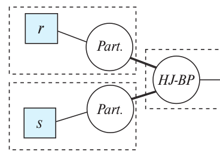

> Explain how to split the hybrid hash-join operator into sub-operators to 
> model pipelining. Also explain how this split is different from the split 
> for a hash-join operator. 

--------------------------------

Suppose we want to join the relations $r$ and $s$. Suppose also $s$ is the build input and
$r$ is the probe input. 

The following paragraph is taken from DSC (the book): 

Hybrid hash join can be viewed as partially pipelined on the probe relation, 
since it can output tuples from the first partition as tuples are received for the 
probe relation. However, tuples that are not in the first partition will be output
only after the entire pipelined input relation is received. Hybrid hash join thus provides
fully pipelined evaluation on its probe input if the build input fits entirely in memory, 
or nearly pipelined evaluation if most of the build input fits in memory. 

## best-case scenario: when the build input entirely fits in memory

Read relation $s$ into memory and create an in-memory hash index on it. 
Thus reading relation $s$ is a blocking operation. Then we read in the tuples of 
relation $r$ in a pipelined fashion and probe the hash index inside of main memory. 
If we find a match we output the result to our output-buffer. 

## medium-case scenario: when most of the build input fits in memory 

In this case we would be fully pipelined when we get input tuples from the probe 
relation that also lay in the first partition. If the tuple doesn't lay in the first 
partition, we have to wait/block to build and probe until constructing the partitions is done.

## worst-case senario: when we have small memory

In this case the sub-operators will be identical to that of the hash-join operator. 

