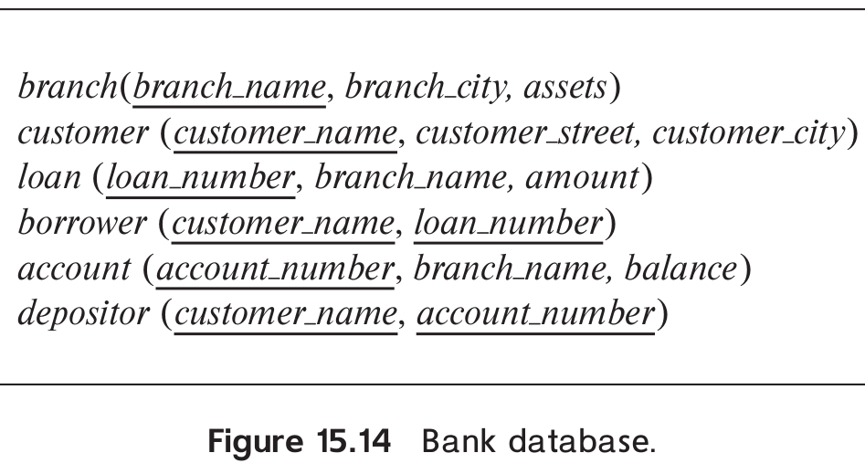

> Consider the bank database of Figure 15.14, where the primary keys are 
> underlined. Suppose that a $B^+$ -tree index on <i>branch_city</i> is 
> available on relation _branch_, and that no other index is available. List 
> different ways to handle the following selections that involve negation: 
> 
> a. $\sigma_{\neg (branch\_city < "Brooklyn")}(branch)$
> 
> b. $\sigma_{\neg (branch\_city = "Brooklyn")}(branch)$
> 
> c. $\sigma_{\neg (branch\_city < "Brooklyn" \lor assets < 5000)}(branch)$
> 
> 

--------------------------------

> a. $\sigma_{\neg (branch\_city < "Brooklyn")}(branch)$

Use the index to locate the first tuple whose <i>branch_city</i> field has value 
"Brooklyn". From this tuple, follow the pointer chains till the end, retrieving all 
the tuples. 

> b. $\sigma_{\neg (branch\_city = "Brooklyn")}(branch)$

For this query, the index serves no purpose. We can scan the file sequentially and select 
all tuples whose <i>branch_city</i> field is anything other than "Brooklyn". 

> c. $\sigma_{\neg (branch\_city < "Brooklyn" \lor assets < 5000)}(branch)$

This query is equivalent to the query

$$
\sigma_{(branch\_city  \geq "Brooklyn" \land assets \geq 5000)}(branch)
$$

Using the <i>branch_city</i> index, we can retrieve all tuples with <i>branch_city</i>
value greater than or equal to "Brooklyn" by following the pointer chains from the first 
"Brooklyn" tuple. We also apply the additional criteria of $assets \geq 5000$ on every tuple. 