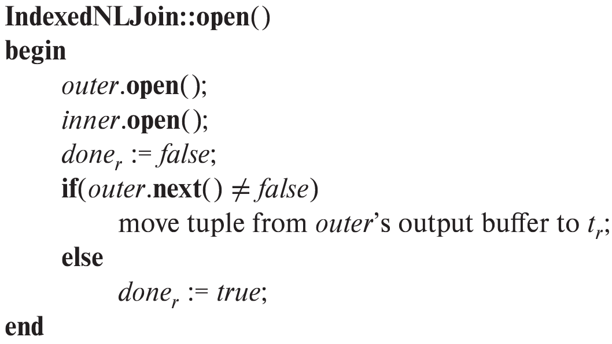
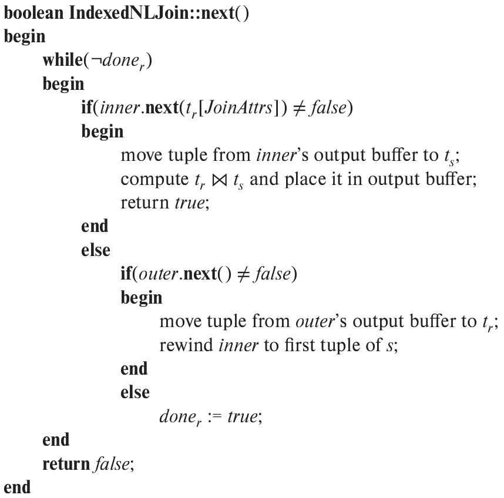
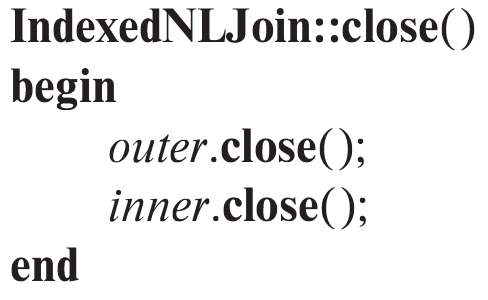

> Write pseudocode for an iterator that implements indexed nested-loop join, 
> where the outer relation is pipelined. Your pseudocode must define the standard 
> iterator functions <i>open()</i>, <i>next()</i>, and <i>close()</i>. Show what state
> information the iterator must maintain between calls. 

--------------------------------

Let <i>outer</i> be the iterator which returns successive tuples from the pipelined outer
relation. Let <i>inner</i> be the iterator which returns successive tuples of the inner relation
having a given value at the join attributes. The <i>inner</i> iterator returns these tuples
by performing an index lookup. The functions **IndexedNLJoin::open**, **IndexedNLJoin::close**
and **IndexedNLJoin::next** to implement the indexed nested-loop join iterator are given below. 

The two iterators <i>outer</i> and <i>inner</i>, the value of the last read outer relation 
tuple $t_r$ and a flag $\text{done}_r$ indicating whether the end of the outer relation 
scan has been reached are the state information which need to be remembered by 
**IndexedNLJoin** between calls. 

